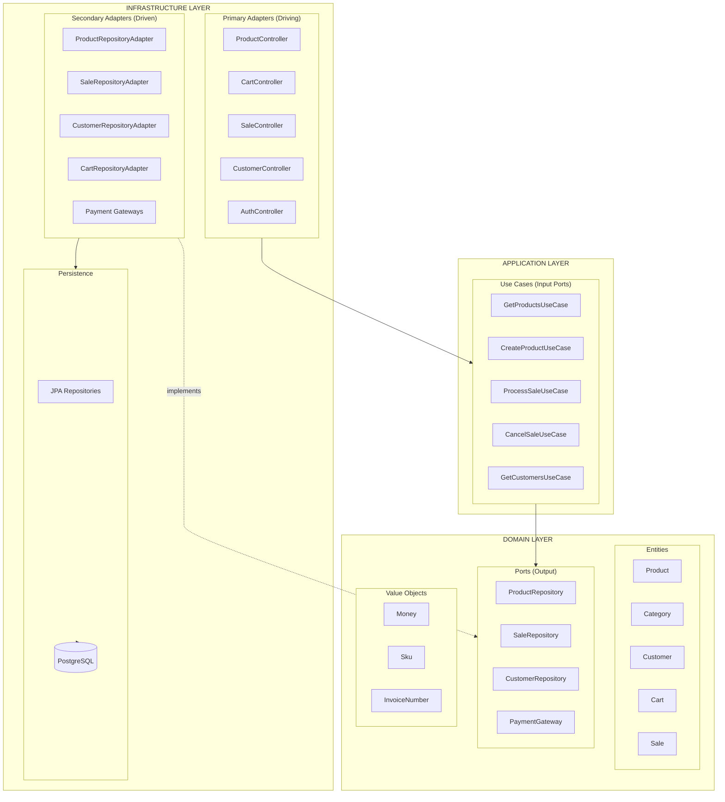
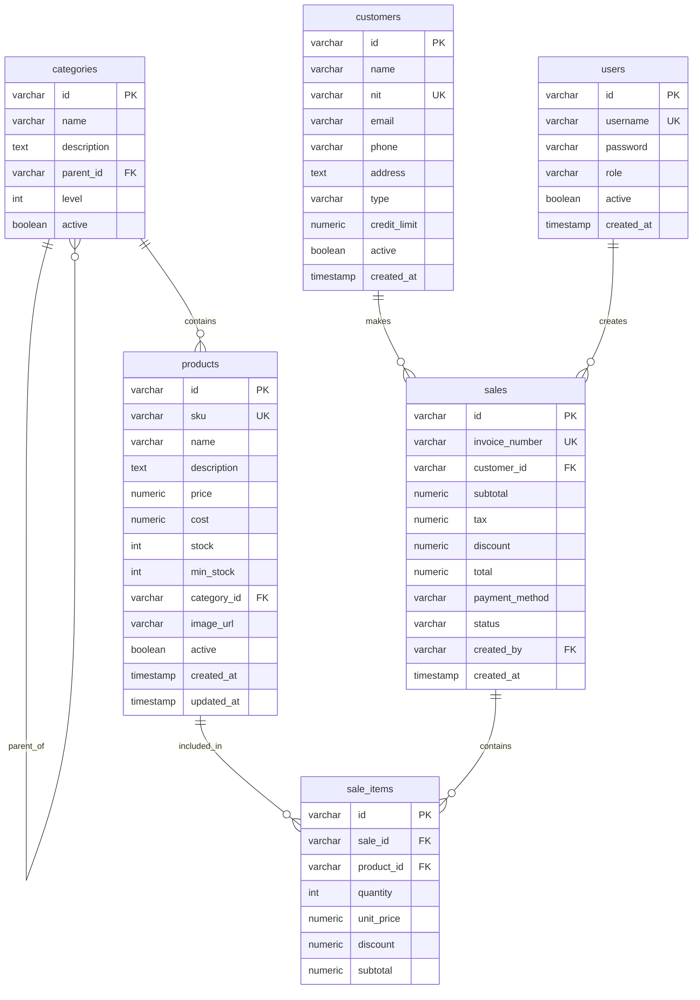
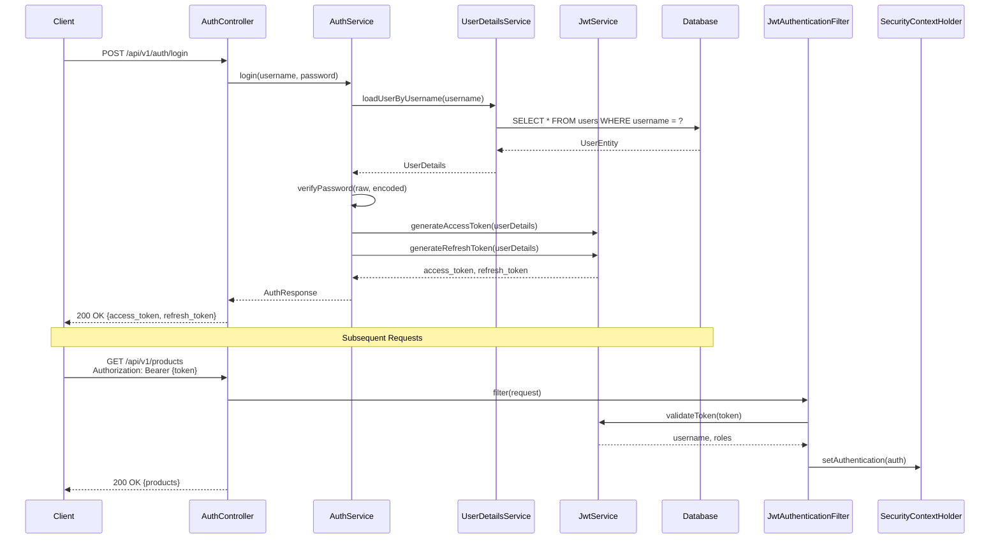
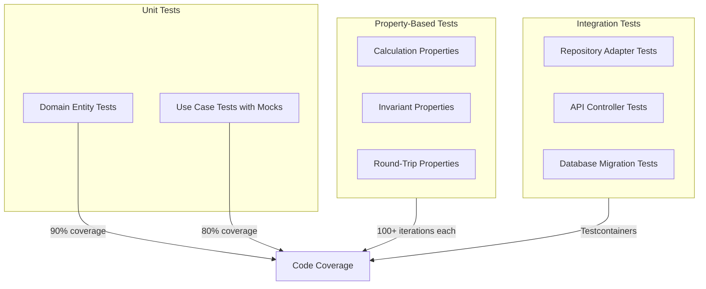

# Design Document — POS Backend API

## Overview

The **POS Backend API** is a RESTful service for a Point of Sale system built with **Java 21** and **Spring Boot 3.x** using **Hexagonal Architecture (Ports & Adapters)**. The system manages the complete sales workflow: product catalog management, customer registration, cart operations, sales processing with automatic inventory control, invoicing, and sales history with reporting capabilities.

### Key Characteristics

- **Architecture Style**: Hexagonal (Ports & Adapters) with strict dependency rule
- **Language**: Java 21 (LTS)
- **Framework**: Spring Boot 3.x
- **Persistence**: Spring Data JPA + Hibernate
- **Database**: PostgreSQL
- **Security**: Spring Security + JWT (15-min access, 7-day refresh)
- **Documentation**: SpringDoc OpenAPI 3 (Swagger UI)
- **Testing**: JUnit 5 + Mockito + Testcontainers

### Core Business Rules

| Rule | Description |
|------|-------------|
| Stock Non-Negativity | Stock can never be negative; rejected with HTTP 422 |
| IVA Calculation | 19% tax on subtotal, rounded to 2 decimal places |
| Unique Identifiers | SKU (products), NIT (customers), invoice_number (sales) are unique |
| Role-Based Access | USER can process sales; ADMIN can manage products and cancel sales |
| Invoice Format | `INV-{YYYYMMDD}-{SEQUENCE}` - unique, sequential, daily reset |

---

## Architecture

### High-Level Architecture Diagram



### Layer Responsibilities

#### Domain Layer (Innermost)

The domain layer contains pure business logic with **zero dependencies** on Spring or infrastructure frameworks.

| Component | Responsibility |
|-----------|---------------|
| **Entities** | Rich domain objects with encapsulated business logic (`Product`, `Sale`, `Cart`, `Customer`, `Category`) |
| **Value Objects** | Immutable objects representing domain concepts (`Money`, `Sku`, `InvoiceNumber`) |
| **Ports** | Interfaces defining contracts for external dependencies (`ProductRepository`, `PaymentGateway`) |
| **Domain Services** | Complex business logic spanning multiple entities |
| **Domain Events** | Events signaling state changes (e.g., `SaleCompleted`, `StockLow`) |
| **Domain Exceptions** | Business rule violations (`InsufficientStockException`, `SaleAlreadyCancelledException`) |

#### Application Layer

The application layer orchestrates use cases and coordinates domain objects.

| Component | Responsibility |
|-----------|---------------|
| **Use Case Interfaces** | Input ports defining available operations (`ProcessSaleUseCase`, `GetProductsUseCase`) |
| **Use Case Implementations** | Application services implementing business workflows with `@Transactional` |
| **DTOs** | Data Transfer Objects for request/response (`CreateProductRequest`, `SaleResponse`) |
| **Application Services** | Cross-cutting concerns like validation and mapping |

#### Infrastructure Layer (Outermost)

The infrastructure layer implements technical details and external integrations.

| Component | Responsibility |
|-----------|---------------|
| **REST Controllers** | Primary adapters handling HTTP requests (`ProductController`, `SaleController`) |
| **JPA Entities** | Database-mapped objects (`ProductEntity`, `SaleEntity`) |
| **Repository Adapters** | Secondary adapters implementing domain ports |
| **Payment Gateways** | External payment integrations (`CashPaymentGateway`, `CardPaymentGateway`) |
| **Configuration** | Spring configuration beans (`SecurityConfig`, `OpenApiConfig`) |

### Dependency Rule

```
Domain ← Application ← Infrastructure
```

- **Domain** imports nothing from other layers
- **Application** imports only from Domain
- **Infrastructure** imports from Application and Domain

---

## Components and Interfaces

### Domain Layer

#### Entities

```java
// domain/model/Product.java
public class Product {
    private String id;
    private String sku;
    private String name;
    private String description;
    private BigDecimal price;
    private BigDecimal cost;
    private int stock;
    private int minStock;
    private Category category;
    private String imageUrl;
    private boolean active;
    private LocalDateTime createdAt;
    private LocalDateTime updatedAt;

    // Factory method
    public static Product create(String sku, String name, BigDecimal price, 
                                  BigDecimal cost, int stock, int minStock, 
                                  Category category) {
        validatePrice(price);
        validateStock(stock);
        return new Product(/*...*/);
    }

    // Business logic
    public boolean isAvailable() {
        return active && stock > 0;
    }

    public boolean isLowStock() {
        return stock <= minStock;
    }

    public void decreaseStock(int quantity) {
        if (quantity > stock) {
            throw new InsufficientStockException(id, quantity, stock);
        }
        this.stock -= quantity;
        this.updatedAt = LocalDateTime.now();
    }

    public void increaseStock(int quantity) {
        this.stock += quantity;
        this.updatedAt = LocalDateTime.now();
    }

    public BigDecimal getProfitMargin() {
        if (cost.compareTo(BigDecimal.ZERO) == 0) return BigDecimal.ZERO;
        return price.subtract(cost)
                    .divide(price, 4, RoundingMode.HALF_UP)
                    .multiply(BigDecimal.valueOf(100));
    }

    public void activate() { this.active = true; }
    public void deactivate() { this.active = false; }
}
```

```java
// domain/model/Cart.java
public class Cart {
    private String id;
    private List<CartItem> items = new ArrayList<>();
    private String customerId;
    private LocalDateTime createdAt;
    private LocalDateTime updatedAt;

    public void addItem(Product product, int quantity) {
        if (!product.isAvailable()) {
            throw new ProductNotAvailableException(product.getId());
        }
        if (quantity > product.getStock()) {
            throw new InsufficientStockException(product.getId(), quantity, product.getStock());
        }
        
        items.stream()
             .filter(i -> i.getProductId().equals(product.getId()))
             .findFirst()
             .ifPresentOrElse(
                 existing -> {
                     int newQuantity = existing.getQuantity() + quantity;
                     if (newQuantity > product.getStock()) {
                         throw new InsufficientStockException(product.getId(), newQuantity, product.getStock());
                     }
                     existing.setQuantity(newQuantity);
                 },
                 () -> items.add(new CartItem(product, quantity))
             );
        this.updatedAt = LocalDateTime.now();
    }

    public void removeItem(String productId) {
        boolean removed = items.removeIf(i -> i.getProductId().equals(productId));
        if (!removed) {
            throw new CartItemNotFoundException(productId);
        }
        this.updatedAt = LocalDateTime.now();
    }

    public BigDecimal getSubtotal() {
        return items.stream()
                    .map(CartItem::getSubtotal)
                    .reduce(BigDecimal.ZERO, BigDecimal::add);
    }

    public BigDecimal getTax() {
        return getSubtotal().multiply(BigDecimal.valueOf(0.19))
                           .setScale(2, RoundingMode.HALF_UP);
    }

    public BigDecimal getTotal() {
        return getSubtotal().add(getTax());
    }

    public void clear() {
        items.clear();
        this.updatedAt = LocalDateTime.now();
    }
}
```

```java
// domain/model/Sale.java
public class Sale {
    private String id;
    private String invoiceNumber;
    private String customerId;
    private List<SaleItem> items = new ArrayList<>();
    private BigDecimal subtotal;
    private BigDecimal tax;
    private BigDecimal discount;
    private BigDecimal total;
    private PaymentMethod paymentMethod;
    private SaleStatus status;
    private String createdBy;
    private LocalDateTime createdAt;

    // Factory method from Cart
    public static Sale from(Cart cart, String customerId, PaymentMethod paymentMethod, 
                            String invoiceNumber, String createdBy) {
        Sale sale = new Sale();
        sale.id = UUID.randomUUID().toString();
        sale.invoiceNumber = invoiceNumber;
        sale.customerId = customerId;
        sale.subtotal = cart.getSubtotal();
        sale.tax = cart.getTax();
        sale.discount = BigDecimal.ZERO;
        sale.total = cart.getTotal();
        sale.paymentMethod = paymentMethod;
        sale.status = SaleStatus.COMPLETED;
        sale.createdBy = createdBy;
        sale.createdAt = LocalDateTime.now();
        
        cart.getItems().forEach(item -> 
            sale.items.add(SaleItem.from(item))
        );
        
        return sale;
    }

    public void cancel() {
        if (status == SaleStatus.CANCELLED) {
            throw new SaleAlreadyCancelledException(id);
        }
        if (status != SaleStatus.COMPLETED) {
            throw new InvalidSaleStatusForCancellationException(id, status);
        }
        this.status = SaleStatus.CANCELLED;
    }

    public List<StockReversal> getStockReversals() {
        return items.stream()
                    .map(i -> new StockReversal(i.getProductId(), i.getQuantity()))
                    .toList();
    }
}
```

```java
// domain/model/Customer.java
public class Customer {
    private String id;
    private String name;
    private String nit;
    private String email;
    private String phone;
    private String address;
    private CustomerType type;
    private BigDecimal creditLimit;
    private boolean active;
    private LocalDateTime createdAt;

    public static Customer create(String name, String nit, CustomerType type, 
                                   BigDecimal creditLimit) {
        validateNit(nit);
        validateCreditLimit(type, creditLimit);
        return new Customer(/*...*/);
    }

    private static void validateCreditLimit(CustomerType type, BigDecimal creditLimit) {
        if (type == CustomerType.REGULAR && creditLimit != null) {
            throw new RegularCustomerCannotHaveCreditLimitException();
        }
        if (creditLimit != null && creditLimit.compareTo(BigDecimal.ZERO) < 0) {
            throw new InvalidCreditLimitException("Credit limit cannot be negative");
        }
        if (creditLimit != null && creditLimit.compareTo(new BigDecimal("999999999.99")) > 0) {
            throw new InvalidCreditLimitException("Credit limit exceeds maximum");
        }
    }
}
```

```java
// domain/model/Category.java
public class Category {
    private String id;
    private String name;
    private String description;
    private Category parent;
    private List<Category> children = new ArrayList<>();
    private int level;
    private boolean active;

    public boolean hasChildren() {
        return !children.isEmpty();
    }

    public boolean hasProducts() {
        // Checked via repository
        return false;
    }

    public boolean isRoot() {
        return parent == null;
    }
}
```

#### Value Objects

```java
// domain/valueobject/Money.java
public record Money(BigDecimal amount) {
    public Money {
        if (amount.compareTo(BigDecimal.ZERO) < 0) {
            throw new IllegalArgumentException("Money cannot be negative");
        }
        amount = amount.setScale(2, RoundingMode.HALF_UP);
    }

    public Money add(Money other) {
        return new Money(amount.add(other.amount));
    }

    public Money subtract(Money other) {
        return new Money(amount.subtract(other.amount));
    }

    public Money multiply(BigDecimal factor) {
        return new Money(amount.multiply(factor).setScale(2, RoundingMode.HALF_UP));
    }

    public Money percentage(int percent) {
        return multiply(BigDecimal.valueOf(percent).divide(BigDecimal.valueOf(100)));
    }
}
```

```java
// domain/valueobject/InvoiceNumber.java
public record InvoiceNumber(String value) {
    private static final Pattern PATTERN = Pattern.compile("^INV-\\d{8}-\\d+$");

    public InvoiceNumber {
        if (!PATTERN.matcher(value).matches()) {
            throw new IllegalArgumentException("Invalid invoice number format: " + value);
        }
    }

    public static InvoiceNumber generate(LocalDate date, long sequence) {
        String dateStr = date.format(DateTimeFormatter.ofPattern("yyyyMMdd"));
        return new InvoiceNumber(String.format("INV-%s-%d", dateStr, sequence));
    }
}
```

#### Ports (Output Interfaces)

```java
// domain/port/ProductRepository.java
public interface ProductRepository {
    Page<Product> findAll(ProductFilters filters, Pageable pageable);
    Optional<Product> findById(String id);
    Optional<Product> findBySku(String sku);
    Product save(Product product);
    void deleteById(String id);
    boolean existsBySku(String sku);
    List<Product> findLowStockProducts();
}
```

```java
// domain/port/SaleRepository.java
public interface SaleRepository {
    Page<Sale> findAll(SaleFilters filters, Pageable pageable);
    Optional<Sale> findById(String id);
    Optional<Sale> findByInvoiceNumber(String invoiceNumber);
    Sale save(Sale sale);
    long getNextInvoiceSequence(LocalDate date);
}
```

```java
// domain/port/CartRepository.java
public interface CartRepository {
    Optional<Cart> findById(String id);
    Cart save(Cart cart);
    void deleteById(String id);
}
```

```java
// domain/port/CustomerRepository.java
public interface CustomerRepository {
    Page<Customer> findAll(CustomerFilters filters, Pageable pageable);
    Optional<Customer> findById(String id);
    Optional<Customer> findByNit(String nit);
    Customer save(Customer customer);
    boolean existsByNit(String nit);
}
```

```java
// domain/port/PaymentGateway.java
public interface PaymentGateway {
    PaymentResult process(BigDecimal amount, PaymentDetails details);
    PaymentMethod getSupportedMethod();
}
```

#### Domain Events

```java
// domain/event/DomainEvent.java
public interface DomainEvent {
    Instant occurredAt();
}

// domain/event/SaleCompletedEvent.java
public record SaleCompletedEvent(String saleId, String invoiceNumber, 
                                  BigDecimal total, Instant occurredAt) implements DomainEvent {}

// domain/event/StockLowEvent.java
public record StockLowEvent(String productId, String sku, String productName,
                             int currentStock, int minStock, Instant occurredAt) implements DomainEvent {}
```

#### Domain Exceptions

```java
// domain/exception/ProductNotFoundException.java
public class ProductNotFoundException extends RuntimeException {
    public ProductNotFoundException(String productId) {
        super("Product not found with ID: " + productId);
    }
}

// domain/exception/InsufficientStockException.java
public class InsufficientStockException extends RuntimeException {
    private final String productId;
    private final int requested;
    private final int available;

    public InsufficientStockException(String productId, int requested, int available) {
        super(String.format("Insufficient stock for product %s. Requested: %d, Available: %d", 
              productId, requested, available));
        this.productId = productId;
        this.requested = requested;
        this.available = available;
    }

    public String getProductId() { return productId; }
    public int getRequested() { return requested; }
    public int getAvailable() { return available; }
}

// domain/exception/SaleAlreadyCancelledException.java
public class SaleAlreadyCancelledException extends RuntimeException {
    public SaleAlreadyCancelledException(String saleId) {
        super("Sale " + saleId + " is already cancelled");
    }
}

// domain/exception/DuplicateSkuException.java
public class DuplicateSkuException extends RuntimeException {
    public DuplicateSkuException(String sku) {
        super("Product with SKU '" + sku + "' already exists");
    }
}

// domain/exception/DuplicateNitException.java
public class DuplicateNitException extends RuntimeException {
    public DuplicateNitException(String nit) {
        super("Customer with NIT '" + nit + "' already exists");
    }
}
```

#### Domain Enums

```java
// domain/enums/PaymentMethod.java
public enum PaymentMethod {
    CASH, CARD, TRANSFER, MIXED
}

// domain/enums/SaleStatus.java
public enum SaleStatus {
    PENDING, COMPLETED, CANCELLED, REFUNDED
}

// domain/enums/CustomerType.java
public enum CustomerType {
    REGULAR, VIP, CORPORATE
}
```

### Application Layer

#### Use Case Interfaces (Input Ports)

```java
// application/port/in/ProductUseCases.java
public interface GetProductsUseCase {
    Page<ProductResponse> execute(ProductFilters filters, Pageable pageable);
}

public interface GetProductByIdUseCase {
    ProductResponse execute(String id);
}

public interface CreateProductUseCase {
    ProductResponse execute(CreateProductRequest request);
}

public interface UpdateProductUseCase {
    ProductResponse execute(String id, UpdateProductRequest request);
}

public interface DeleteProductUseCase {
    void execute(String id);
}
```

```java
// application/port/in/CartUseCases.java
public interface CreateCartUseCase {
    CartResponse execute(CreateCartRequest request);
}

public interface AddProductToCartUseCase {
    CartResponse execute(String cartId, AddToCartRequest request);
}

public interface RemoveProductFromCartUseCase {
    CartResponse execute(String cartId, String productId);
}

public interface GetCartUseCase {
    CartResponse execute(String cartId);
}
```

```java
// application/port/in/SaleUseCases.java
public interface ProcessSaleUseCase {
    SaleResponse execute(ProcessSaleRequest request);
}

public interface CancelSaleUseCase {
    SaleResponse execute(String saleId);
}

public interface GetSalesHistoryUseCase {
    Page<SaleResponse> execute(SaleFilters filters, Pageable pageable, String username, String role);
}

public interface GetSaleByIdUseCase {
    SaleResponse execute(String saleId);
}
```

```java
// application/port/in/CustomerUseCases.java
public interface GetCustomersUseCase {
    Page<CustomerResponse> execute(CustomerFilters filters, Pageable pageable);
}

public interface CreateCustomerUseCase {
    CustomerResponse execute(CreateCustomerRequest request);
}
```

#### Use Case Implementations

```java
// application/usecase/ProcessSaleService.java
@Service
public class ProcessSaleService implements ProcessSaleUseCase {

    private final SaleRepository saleRepository;
    private final CartRepository cartRepository;
    private final ProductRepository productRepository;
    private final CustomerRepository customerRepository;
    private final Map<PaymentMethod, PaymentGateway> paymentGateways;

    public ProcessSaleService(
            SaleRepository saleRepository,
            CartRepository cartRepository,
            ProductRepository productRepository,
            CustomerRepository customerRepository,
            List<PaymentGateway> gatewayList) {
        this.saleRepository = saleRepository;
        this.cartRepository = cartRepository;
        this.productRepository = productRepository;
        this.customerRepository = customerRepository;
        this.paymentGateways = gatewayList.stream()
            .collect(Collectors.toMap(PaymentGateway::getSupportedMethod, Function.identity()));
    }

    @Override
    @Transactional
    public SaleResponse execute(ProcessSaleRequest request) {
        // 1. Validate cart exists
        Cart cart = cartRepository.findById(request.cartId())
            .orElseThrow(() -> new CartNotFoundException(request.cartId()));

        if (cart.getItems().isEmpty()) {
            throw new EmptyCartException(request.cartId());
        }

        // 2. Validate stock for all items (before any modification)
        validateStockAvailability(cart);

        // 3. Process payment
        PaymentGateway gateway = paymentGateways.get(request.paymentMethod());
        if (gateway == null) {
            throw new UnsupportedPaymentMethodException(request.paymentMethod());
        }
        
        PaymentResult payment = gateway.process(cart.getTotal(), request.paymentDetails());
        if (!payment.isSuccess()) {
            throw new PaymentFailedException(payment.getError());
        }

        // 4. Deduct stock (within transaction)
        deductStock(cart);

        // 5. Generate invoice number
        LocalDate today = LocalDate.now();
        long sequence = saleRepository.getNextInvoiceSequence(today);
        InvoiceNumber invoiceNumber = InvoiceNumber.generate(today, sequence);

        // 6. Create sale
        Sale sale = Sale.from(cart, request.customerId(), request.paymentMethod(), 
                              invoiceNumber.value(), SecurityContextHolder.getContext()
                                  .getAuthentication().getName());
        
        Sale saved = saleRepository.save(sale);

        // 7. Clear cart
        cartRepository.deleteById(request.cartId());

        return SaleMapper.toResponse(saved);
    }

    private void validateStockAvailability(Cart cart) {
        for (CartItem item : cart.getItems()) {
            Product product = productRepository.findById(item.getProductId())
                .orElseThrow(() -> new ProductNotFoundException(item.getProductId()));
            
            if (!product.isActive()) {
                throw new ProductNotAvailableException(product.getId());
            }
            if (item.getQuantity() > product.getStock()) {
                throw new InsufficientStockException(product.getId(), 
                    item.getQuantity(), product.getStock());
            }
        }
    }

    private void deductStock(Cart cart) {
        for (CartItem item : cart.getItems()) {
            Product product = productRepository.findById(item.getProductId())
                .orElseThrow(() -> new ProductNotFoundException(item.getProductId()));
            product.decreaseStock(item.getQuantity());
            productRepository.save(product);
        }
    }
}
```

```java
// application/usecase/CancelSaleService.java
@Service
public class CancelSaleService implements CancelSaleUseCase {

    private final SaleRepository saleRepository;
    private final ProductRepository productRepository;

    public CancelSaleService(SaleRepository saleRepository, ProductRepository productRepository) {
        this.saleRepository = saleRepository;
        this.productRepository = productRepository;
    }

    @Override
    @Transactional
    public SaleResponse execute(String saleId) {
        Sale sale = saleRepository.findById(saleId)
            .orElseThrow(() -> new SaleNotFoundException(saleId));

        sale.cancel(); // Validates state

        // Restore stock
        restoreStock(sale);

        Sale saved = saleRepository.save(sale);
        return SaleMapper.toResponse(saved);
    }

    private void restoreStock(Sale sale) {
        for (StockReversal reversal : sale.getStockReversals()) {
            Product product = productRepository.findById(reversal.productId())
                .orElseThrow(() -> new ProductNotFoundException(reversal.productId()));
            product.increaseStock(reversal.quantity());
            productRepository.save(product);
        }
    }
}
```

```java
// application/usecase/CreateProductService.java
@Service
public class CreateProductService implements CreateProductUseCase {

    private final ProductRepository productRepository;
    private final CategoryRepository categoryRepository;

    public CreateProductService(ProductRepository productRepository, 
                                 CategoryRepository categoryRepository) {
        this.productRepository = productRepository;
        this.categoryRepository = categoryRepository;
    }

    @Override
    public ProductResponse execute(CreateProductRequest request) {
        // Validate unique SKU
        if (productRepository.existsBySku(request.sku())) {
            throw new DuplicateSkuException(request.sku());
        }

        // Validate category exists
        Category category = categoryRepository.findById(request.categoryId())
            .orElseThrow(() -> new CategoryNotFoundException(request.categoryId()));

        Product product = Product.create(
            request.sku(),
            request.name(),
            request.price(),
            request.cost(),
            request.stock(),
            request.minStock(),
            category
        );

        if (request.description() != null) {
            product.setDescription(request.description());
        }
        if (request.imageUrl() != null) {
            product.setImageUrl(request.imageUrl());
        }

        Product saved = productRepository.save(product);
        return ProductMapper.toResponse(saved);
    }
}
```

#### DTOs

```java
// application/dto/request/CreateProductRequest.java
public record CreateProductRequest(
    @NotBlank(message = "SKU is required")
    @Size(max = 50, message = "SKU must not exceed 50 characters")
    String sku,
    
    @NotBlank(message = "Name is required")
    @Size(max = 200, message = "Name must not exceed 200 characters")
    String name,
    
    @Size(max = 1000, message = "Description must not exceed 1000 characters")
    String description,
    
    @NotNull(message = "Price is required")
    @DecimalMin(value = "0.01", message = "Price must be greater than zero")
    @Digits(integer = 8, fraction = 2, message = "Price must have at most 2 decimal places")
    BigDecimal price,
    
    @DecimalMin(value = "0.00", message = "Cost cannot be negative")
    @Digits(integer = 8, fraction = 2, message = "Cost must have at most 2 decimal places")
    BigDecimal cost,
    
    @Min(value = 0, message = "Stock cannot be negative")
    int stock,
    
    @Min(value = 0, message = "Minimum stock cannot be negative")
    int minStock,
    
    @NotBlank(message = "Category ID is required")
    String categoryId,
    
    @URL(message = "Image URL must be a valid URL")
    @Size(max = 500, message = "Image URL must not exceed 500 characters")
    String imageUrl
) {}

// application/dto/request/UpdateProductRequest.java
public record UpdateProductRequest(
    @Size(max = 50, message = "SKU must not exceed 50 characters")
    String sku,
    
    @Size(max = 200, message = "Name must not exceed 200 characters")
    String name,
    
    @Size(max = 1000, message = "Description must not exceed 1000 characters")
    String description,
    
    @DecimalMin(value = "0.01", message = "Price must be greater than zero")
    @Digits(integer = 8, fraction = 2, message = "Price must have at most 2 decimal places")
    BigDecimal price,
    
    @DecimalMin(value = "0.00", message = "Cost cannot be negative")
    @Digits(integer = 8, fraction = 2, message = "Cost must have at most 2 decimal places")
    BigDecimal cost,
    
    @Min(value = 0, message = "Stock cannot be negative")
    Integer stock,
    
    @Min(value = 0, message = "Minimum stock cannot be negative")
    Integer minStock,
    
    String categoryId,
    
    @URL(message = "Image URL must be a valid URL")
    String imageUrl,
    
    Boolean active
) {}

// application/dto/request/AddToCartRequest.java
public record AddToCartRequest(
    @NotBlank(message = "Product ID is required")
    String productId,
    
    @Min(value = 1, message = "Quantity must be at least 1")
    @Max(value = 999999, message = "Quantity cannot exceed 999,999")
    int quantity
) {}

// application/dto/request/ProcessSaleRequest.java
public record ProcessSaleRequest(
    @NotBlank(message = "Cart ID is required")
    String cartId,
    
    String customerId,
    
    @NotNull(message = "Payment method is required")
    PaymentMethod paymentMethod,
    
    @NotNull(message = "Payment details are required")
    PaymentDetails paymentDetails
) {}

// application/dto/request/PaymentDetails.java
public record PaymentDetails(
    @DecimalMin(value = "0.00", message = "Cash received cannot be negative")
    BigDecimal cashReceived,
    
    CardDetails cardDetails,
    
    @Size(max = 100, message = "Transfer reference must not exceed 100 characters")
    String transferReference
) {}

// application/dto/request/CardDetails.java
public record CardDetails(
    @Size(max = 4, message = "Last 4 digits required")
    String lastFourDigits,
    
    @Size(max = 50, message = "Card type must not exceed 50 characters")
    String cardType,
    
    @Size(max = 100, message = "Authorization code must not exceed 100 characters")
    String authorizationCode
) {}
```

```java
// application/dto/response/ProductResponse.java
public record ProductResponse(
    String id,
    String sku,
    String name,
    String description,
    BigDecimal price,
    BigDecimal cost,
    int stock,
    int minStock,
    boolean lowStock,
    CategoryResponse category,
    String imageUrl,
    boolean active,
    BigDecimal profitMargin,
    LocalDateTime createdAt,
    LocalDateTime updatedAt
) {}

// application/dto/response/CategoryResponse.java
public record CategoryResponse(
    String id,
    String name,
    String description,
    String parentId,
    String parentName,
    int level,
    boolean active
) {}

// application/dto/response/CartResponse.java
public record CartResponse(
    String id,
    String customerId,
    List<CartItemResponse> items,
    BigDecimal subtotal,
    BigDecimal tax,
    BigDecimal total,
    LocalDateTime createdAt,
    LocalDateTime updatedAt
) {}

// application/dto/response/CartItemResponse.java
public record CartItemResponse(
    String productId,
    String productName,
    String productSku,
    BigDecimal unitPrice,
    int quantity,
    BigDecimal subtotal
) {}

// application/dto/response/SaleResponse.java
public record SaleResponse(
    String id,
    String invoiceNumber,
    String customerId,
    String customerName,
    List<SaleItemResponse> items,
    BigDecimal subtotal,
    BigDecimal tax,
    BigDecimal discount,
    BigDecimal total,
    PaymentMethod paymentMethod,
    SaleStatus status,
    String createdBy,
    LocalDateTime createdAt
) {}

// application/dto/response/SaleItemResponse.java
public record SaleItemResponse(
    String productId,
    String productName,
    String productSku,
    int quantity,
    BigDecimal unitPrice,
    BigDecimal discount,
    BigDecimal subtotal
) {}

// application/dto/response/CustomerResponse.java
public record CustomerResponse(
    String id,
    String name,
    String nit,
    String email,
    String phone,
    String address,
    CustomerType type,
    BigDecimal creditLimit,
    boolean active,
    LocalDateTime createdAt
) {}

// application/dto/response/PagedResponse.java
public record PagedResponse<T>(
    List<T> items,
    int page,
    int pageSize,
    long totalItems,
    int totalPages,
    boolean hasNext,
    boolean hasPrevious
) {
    public static <T> PagedResponse<T> from(Page<T> page) {
        return new PagedResponse<>(
            page.getContent(),
            page.getNumber(),
            page.getSize(),
            page.getTotalElements(),
            page.getTotalPages(),
            page.hasNext(),
            page.hasPrevious()
        );
    }
}
```

```java
// application/dto/response/ApiErrorResponse.java
public record ApiErrorResponse(
    String code,
    String message,
    Instant timestamp,
    Map<String, String> details
) {
    public ApiErrorResponse(String code, String message) {
        this(code, message, Instant.now(), null);
    }
    
    public ApiErrorResponse(String code, String message, Map<String, String> details) {
        this(code, message, Instant.now(), details);
    }
}

// application/dto/response/AuthResponse.java
public record AuthResponse(
    String accessToken,
    String refreshToken,
    String tokenType,
    long expiresIn
) {
    public static final String BEARER = "Bearer";
}
```

### Infrastructure Layer

#### REST Controllers

```java
// infrastructure/web/controller/ProductController.java
@RestController
@RequestMapping("/api/v1/products")
@Tag(name = "Products", description = "Product catalog management")
@RequiredArgsConstructor
public class ProductController {

    private final GetProductsUseCase getProducts;
    private final GetProductByIdUseCase getProductById;
    private final CreateProductUseCase createProduct;
    private final UpdateProductUseCase updateProduct;
    private final DeleteProductUseCase deleteProduct;

    @GetMapping
    @Operation(summary = "List products", description = "Get paginated product list with filters")
    @PreAuthorize("hasAnyRole('USER', 'ADMIN')")
    public ResponseEntity<PagedResponse<ProductResponse>> getAll(
            @ParameterObject ProductFilters filters,
            @PageableDefault(size = 20) @ParameterObject Pageable pageable) {
        Page<ProductResponse> page = getProducts.execute(filters, pageable);
        return ResponseEntity.ok(PagedResponse.from(page));
    }

    @GetMapping("/{id}")
    @Operation(summary = "Get product by ID")
    @PreAuthorize("hasAnyRole('USER', 'ADMIN')")
    public ResponseEntity<ProductResponse> getById(@PathVariable String id) {
        return ResponseEntity.ok(getProductById.execute(id));
    }

    @PostMapping
    @Operation(summary = "Create product", description = "ADMIN only")
    @PreAuthorize("hasRole('ADMIN')")
    public ResponseEntity<ProductResponse> create(
            @Valid @RequestBody CreateProductRequest request) {
        ProductResponse product = createProduct.execute(request);
        return ResponseEntity.status(HttpStatus.CREATED).body(product);
    }

    @PutMapping("/{id}")
    @Operation(summary = "Update product", description = "ADMIN only")
    @PreAuthorize("hasRole('ADMIN')")
    public ResponseEntity<ProductResponse> update(
            @PathVariable String id,
            @Valid @RequestBody UpdateProductRequest request) {
        return ResponseEntity.ok(updateProduct.execute(id, request));
    }

    @DeleteMapping("/{id}")
    @Operation(summary = "Delete product", description = "ADMIN only")
    @PreAuthorize("hasRole('ADMIN')")
    public ResponseEntity<Void> delete(@PathVariable String id) {
        deleteProduct.execute(id);
        return ResponseEntity.noContent().build();
    }
}
```

```java
// infrastructure/web/controller/SaleController.java
@RestController
@RequestMapping("/api/v1/sales")
@Tag(name = "Sales", description = "Sales processing and history")
@RequiredArgsConstructor
public class SaleController {

    private final ProcessSaleUseCase processSale;
    private final CancelSaleUseCase cancelSale;
    private final GetSalesHistoryUseCase getSalesHistory;
    private final GetSaleByIdUseCase getSaleById;

    @PostMapping
    @Operation(summary = "Process sale", description = "Complete a sale from cart")
    @PreAuthorize("hasAnyRole('USER', 'ADMIN')")
    public ResponseEntity<SaleResponse> process(
            @Valid @RequestBody ProcessSaleRequest request) {
        SaleResponse sale = processSale.execute(request);
        return ResponseEntity.status(HttpStatus.CREATED).body(sale);
    }

    @GetMapping
    @Operation(summary = "Sales history", description = "Get paginated sales with filters")
    @PreAuthorize("hasAnyRole('USER', 'ADMIN')")
    public ResponseEntity<PagedResponse<SaleResponse>> getHistory(
            @ParameterObject SaleFilters filters,
            @PageableDefault(size = 20) @ParameterObject Pageable pageable,
            @AuthenticationPrincipal UserDetails userDetails) {
        String role = userDetails.getAuthorities().stream()
            .map(GrantedAuthority::getAuthority)
            .filter(a -> a.equals("ROLE_ADMIN"))
            .findFirst()
            .orElse("ROLE_USER");
        
        Page<SaleResponse> page = getSalesHistory.execute(filters, pageable, 
            userDetails.getUsername(), role);
        return ResponseEntity.ok(PagedResponse.from(page));
    }

    @GetMapping("/{id}")
    @Operation(summary = "Get sale by ID")
    @PreAuthorize("hasAnyRole('USER', 'ADMIN')")
    public ResponseEntity<SaleResponse> getById(@PathVariable String id) {
        return ResponseEntity.ok(getSaleById.execute(id));
    }

    @PostMapping("/{id}/cancel")
    @Operation(summary = "Cancel sale", description = "ADMIN only")
    @PreAuthorize("hasRole('ADMIN')")
    public ResponseEntity<SaleResponse> cancel(@PathVariable String id) {
        return ResponseEntity.ok(cancelSale.execute(id));
    }
}
```

```java
// infrastructure/web/controller/AuthController.java
@RestController
@RequestMapping("/api/v1/auth")
@Tag(name = "Authentication", description = "User authentication")
@RequiredArgsConstructor
public class AuthController {

    private final AuthService authService;

    @PostMapping("/login")
    @Operation(summary = "Login", description = "Authenticate user and get tokens")
    public ResponseEntity<AuthResponse> login(@Valid @RequestBody LoginRequest request) {
        return ResponseEntity.ok(authService.login(request));
    }

    @PostMapping("/refresh")
    @Operation(summary = "Refresh token")
    public ResponseEntity<AuthResponse> refresh(@Valid @RequestBody RefreshTokenRequest request) {
        return ResponseEntity.ok(authService.refresh(request.refreshToken()));
    }
}
```

#### Payment Gateway Implementations

```java
// infrastructure/payment/CashPaymentGateway.java
@Component
public class CashPaymentGateway implements PaymentGateway {

    @Override
    public PaymentResult process(BigDecimal amount, PaymentDetails details) {
        if (details.cashReceived() == null) {
            return PaymentResult.failure("Cash received amount is required");
        }
        if (details.cashReceived().compareTo(amount) < 0) {
            return PaymentResult.failure(
                String.format("Insufficient cash. Required: %s, Received: %s", 
                    amount, details.cashReceived())
            );
        }
        return PaymentResult.success(details.cashReceived().subtract(amount));
    }

    @Override
    public PaymentMethod getSupportedMethod() {
        return PaymentMethod.CASH;
    }
}
```

```java
// infrastructure/payment/CardPaymentGateway.java
@Component
public class CardPaymentGateway implements PaymentGateway {

    @Override
    public PaymentResult process(BigDecimal amount, PaymentDetails details) {
        if (details.cardDetails() == null) {
            return PaymentResult.failure("Card details are required");
        }
        // Simulate card processing (integration with real provider would go here)
        return PaymentResult.success(null);
    }

    @Override
    public PaymentMethod getSupportedMethod() {
        return PaymentMethod.CARD;
    }
}
```

#### Repository Adapters

```java
// infrastructure/persistence/adapter/ProductRepositoryAdapter.java
@Component
@RequiredArgsConstructor
public class ProductRepositoryAdapter implements ProductRepository {

    private final JpaProductRepository jpaRepository;
    private final ProductEntityMapper{}
mapper;

    @Override
    public Page<Product> findAll(ProductFilters filters, Pageable pageable) {
        Specification<ProductEntity> spec = buildSpecification(filters);
        return jpaRepository.findAll(spec, pageable).map(mapper::toDomain);
    }

    @Override
    public Optional<Product> findById(String id) {
        return jpaRepository.findById(id).map(mapper::toDomain);
    }

    @Override
    public Optional<Product> findBySku(String sku) {
        return jpaRepository.findBySku(sku).map(mapper::toDomain);
    }

    @Override
    public Product save(Product product) {
        ProductEntity entity = mapper.toEntity(product);
        ProductEntity saved = jpaRepository.save(entity);
        return mapper.toDomain(saved);
    }

    @Override
    public void deleteById(String id) {
        jpaRepository.deleteById(id);
    }

    @Override
    public boolean existsBySku(String sku) {
        return jpaRepository.existsBySku(sku);
    }

    @Override
    public List<Product> findLowStockProducts() {
        return jpaRepository.findLowStockProducts().stream()
            .map(mapper::toDomain)
            .toList();
    }

    private Specification<ProductEntity> buildSpecification(ProductFilters filters) {
        return Specification
            .where(ProductSpecifications.hasCategoryId(filters.categoryId()))
            .and(ProductSpecifications.hasActive(filters.active()))
            .and(ProductSpecifications.nameContains(filters.name()))
            .and(ProductSpecifications.hasLowStock(filters.lowStock()));
    }
}
```

#### JPA Entities

```java
// infrastructure/persistence/entity/ProductEntity.java
@Entity
@Table(name = "products")
@DynamicUpdate
@AttributeOverrides({
    @AttributeOverride(name = "price", column = @Column(precision = 10, scale = 2)),
    @AttributeOverride(name = "cost", column = @Column(precision = 10, scale = 2))
})
public class ProductEntity {
    
    @Id
    private String id;

    @Column(unique = true, nullable = false, length = 50)
    private String sku;

    @Column(nullable = false, length = 200)
    private String name;

    @Column(columnDefinition = "TEXT")
    private String description;

    @Column(nullable = false, precision = 10, scale = 2)
    private BigDecimal price;

    @Column(nullable = false, precision = 10, scale = 2)
    private BigDecimal cost;

    @Column(nullable = false)
    private int stock;

    @Column(name = "min_stock", nullable = false)
    private int minStock;

    @ManyToOne(fetch = FetchType.LAZY)
    @JoinColumn(name = "category_id")
    private CategoryEntity category;

    @Column(name = "image_url", length = 500)
    private String imageUrl;

    @Column(nullable = false)
    private boolean active = true;

    @CreationTimestamp
    @Column(name = "created_at", nullable = false, updatable = false)
    private LocalDateTime createdAt;

    @UpdateTimestamp
    @Column(name = "updated_at", nullable = false)
    private LocalDateTime updatedAt;
}
```

```java
// infrastructure/persistence/entity/SaleEntity.java
@Entity
@Table(name = "sales")
public class SaleEntity {
    
    @Id
    private String id;

    @Column(name = "invoice_number", unique = true, nullable = false, length = 50)
    private String invoiceNumber;

    @ManyToOne(fetch = FetchType.LAZY)
    @JoinColumn(name = "customer_id")
    private CustomerEntity customer;

    @Column(nullable = false, precision = 10, scale = 2)
    private BigDecimal subtotal;

    @Column(nullable = false, precision = 10, scale = 2)
    private BigDecimal tax;

    @Column(nullable = false, precision = 10, scale = 2)
    private BigDecimal discount;

    @Column(nullable = false, precision = 10, scale = 2)
    private BigDecimal total;

    @Enumerated(EnumType.STRING)
    @Column(name = "payment_method", nullable = false, length = 20)
    private PaymentMethod paymentMethod;

    @Enumerated(EnumType.STRING)
    @Column(nullable = false, length = 20)
    private SaleStatus status = SaleStatus.COMPLETED;

    @Column(name = "created_by", nullable = false)
    private String createdBy;

    @CreationTimestamp
    @Column(name = "created_at", nullable = false, updatable = false)
    private LocalDateTime createdAt;

    @OneToMany(mappedBy = "sale", cascade = CascadeType.ALL, orphanRemoval = true)
    private List<SaleItemEntity> items = new ArrayList<>();
}
```

```java
// infrastructure/persistence/entity/CustomerEntity.java
@Entity
@Table(name = "customers")
public class CustomerEntity {
    
    @Id
    private String id;

    @Column(nullable = false, length = 200)
    private String name;

    @Column(unique = true, nullable = false, length = 20)
    private String nit;

    @Column(length = 200)
    private String email;

    @Column(length = 20)
    private String phone;

    @Column(columnDefinition = "TEXT")
    private String address;

    @Enumerated(EnumType.STRING)
    @Column(name = "type", nullable = false, length = 20)
    private CustomerType type = CustomerType.REGULAR;

    @Column(name = "credit_limit", precision = 10, scale = 2)
    private BigDecimal creditLimit;

    @Column(nullable = false)
    private boolean active = true;

    @CreationTimestamp
    @Column(name = "created_at", nullable = false, updatable = false)
    private LocalDateTime createdAt;
}
```

---

## Data Models

### Database Schema (PostgreSQL)



### SQL Schema Definition

```sql
-- Categories table
CREATE TABLE categories (
    id          VARCHAR(36) PRIMARY KEY,
    name        VARCHAR(100) NOT NULL,
    description TEXT,
    parent_id   VARCHAR(36) REFERENCES categories(id) ON DELETE RESTRICT,
    level       INT NOT NULL DEFAULT 0,
    active      BOOLEAN NOT NULL DEFAULT TRUE
);

-- Products table
CREATE TABLE products (
    id          VARCHAR(36) PRIMARY KEY,
    sku         VARCHAR(50) UNIQUE NOT NULL,
    name        VARCHAR(200) NOT NULL,
    description TEXT,
    price       NUMERIC(10,2) NOT NULL CHECK (price > 0),
    cost        NUMERIC(10,2) NOT NULL DEFAULT 0 CHECK (cost >= 0),
    stock       INT NOT NULL DEFAULT 0 CHECK (stock >= 0),
    min_stock   INT NOT NULL DEFAULT 0 CHECK (min_stock >= 0),
    category_id VARCHAR(36) REFERENCES categories(id) ON DELETE SET NULL,
    image_url   VARCHAR(500),
    active      BOOLEAN NOT NULL DEFAULT TRUE,
    created_at  TIMESTAMP NOT NULL DEFAULT NOW(),
    updated_at  TIMESTAMP NOT NULL DEFAULT NOW()
);

-- Customers table
CREATE TABLE customers (
    id           VARCHAR(36) PRIMARY KEY,
    name         VARCHAR(200) NOT NULL,
    nit          VARCHAR(20) UNIQUE NOT NULL,
    email        VARCHAR(200),
    phone        VARCHAR(20),
    address      TEXT,
    type         VARCHAR(20) NOT NULL DEFAULT 'REGULAR' 
                 CHECK (type IN ('REGULAR', 'VIP', 'CORPORATE')),
    credit_limit NUMERIC(10,2) CHECK (credit_limit >= 0 AND credit_limit <= 999999999.99),
    active       BOOLEAN NOT NULL DEFAULT TRUE,
    created_at   TIMESTAMP NOT NULL DEFAULT NOW()
);

-- Users table
CREATE TABLE users (
    id         VARCHAR(36) PRIMARY KEY,
    username   VARCHAR(50) UNIQUE NOT NULL,
    password   VARCHAR(100) NOT NULL,
    role       VARCHAR(20) NOT NULL DEFAULT 'USER'
               CHECK (role IN ('USER', 'ADMIN')),
    active     BOOLEAN NOT NULL DEFAULT TRUE,
    created_at TIMESTAMP NOT NULL DEFAULT NOW()
);

-- Sales table
CREATE TABLE sales (
    id             VARCHAR(36) PRIMARY KEY,
    invoice_number VARCHAR(50) UNIQUE NOT NULL,
    customer_id    VARCHAR(36) REFERENCES customers(id) ON DELETE SET NULL,
    subtotal       NUMERIC(10,2) NOT NULL CHECK (subtotal >= 0),
    tax            NUMERIC(10,2) NOT NULL CHECK (tax >= 0),
    discount       NUMERIC(10,2) NOT NULL DEFAULT 0 CHECK (discount >= 0),
    total          NUMERIC(10,2) NOT NULL CHECK (total >= 0),
    payment_method VARCHAR(20) NOT NULL 
                   CHECK (payment_method IN ('CASH', 'CARD', 'TRANSFER', 'MIXED')),
    status         VARCHAR(20) NOT NULL DEFAULT 'COMPLETED'
                   CHECK (status IN ('PENDING', 'COMPLETED', 'CANCELLED', 'REFUNDED')),
    created_by     VARCHAR(36) NOT NULL REFERENCES users(id),
    created_at     TIMESTAMP NOT NULL DEFAULT NOW()
);

-- Sale items table
CREATE TABLE sale_items (
    id          VARCHAR(36) PRIMARY KEY,
    sale_id     VARCHAR(36) NOT NULL REFERENCES sales(id) ON DELETE CASCADE,
    product_id  VARCHAR(36) NOT NULL REFERENCES products(id) ON DELETE RESTRICT,
    quantity    INT NOT NULL CHECK (quantity > 0),
    unit_price  NUMERIC(10,2) NOT NULL CHECK (unit_price >= 0),
    discount    NUMERIC(10,2) NOT NULL DEFAULT 0 CHECK (discount >= 0),
    subtotal    NUMERIC(10,2) NOT NULL CHECK (subtotal >= 0)
);

-- Invoice sequence table (for atomic invoice number generation)
CREATE TABLE invoice_sequences (
    id          VARCHAR(36) PRIMARY KEY,
    date        DATE NOT NULL UNIQUE,
    sequence    BIGINT NOT NULL DEFAULT 0
);

-- Indexes
CREATE INDEX idx_products_sku       ON products(sku);
CREATE INDEX idx_products_category  ON products(category_id);
CREATE INDEX idx_products_active    ON products(active);
CREATE INDEX idx_products_stock     ON products(stock, min_stock);
CREATE INDEX idx_sales_customer     ON sales(customer_id);
CREATE INDEX idx_sales_created_at   ON sales(created_at);
CREATE INDEX idx_sales_status       ON sales(status);
CREATE INDEX idx_sales_created_by   ON sales(created_by);
CREATE INDEX idx_customers_nit      ON customers(nit);
CREATE INDEX idx_sale_items_sale    ON sale_items(sale_id);
CREATE INDEX idx_sale_items_product ON sale_items(product_id);
CREATE INDEX idx_invoice_seq_date   ON invoice_sequences(date);
```

### Domain Model vs JPA Entity Mapping

The system uses the **Mapper Pattern** to translate between domain entities and JPA entities:

```java
// infrastructure/persistence/mapper/ProductEntityMapper.java
@Component
public class ProductEntityMapper {

    public Product toDomain(ProductEntity entity) {
        if (entity == null) return null;
        
        Product product = new Product();
        product.setId(entity.getId());
        product.setSku(entity.getSku());
        product.setName(entity.getName());
        product.setDescription(entity.getDescription());
        product.setPrice(entity.getPrice());
        product.setCost(entity.getCost());
        product.setStock(entity.getStock());
        product.setMinStock(entity.getMinStock());
        product.setCategory(toCategoryDomain(entity.getCategory()));
        product.setImageUrl(entity.getImageUrl());
        product.setActive(entity.isActive());
        product.setCreatedAt(entity.getCreatedAt());
        product.setUpdatedAt(entity.getUpdatedAt());
        return product;
    }

    public ProductEntity toEntity(Product product) {
        if (product == null) return null;
        
        ProductEntity entity = new ProductEntity();
        entity.setId(product.getId());
        entity.setSku(product.getSku());
        entity.setName(product.getName());
        entity.setDescription(product.getDescription());
        entity.setPrice(product.getPrice());
        entity.setCost(product.getCost());
        entity.setStock(product.getStock());
        entity.setMinStock(product.getMinStock());
        entity.setCategory(toCategoryEntity(product.getCategory()));
        entity.setImageUrl(product.getImageUrl());
        entity.setActive(product.isActive());
        return entity;
    }

    // Similar mappers for Category, Sale, Customer, etc.
}
```

---

## Error Handling

### Exception Hierarchy

```java
// domain/exception/DomainException.java
public abstract class DomainException extends RuntimeException {
    protected DomainException(String message) {
        super(message);
    }
}

// domain/exception/EntityNotFoundException.java
public abstract class EntityNotFoundException extends DomainException {
    protected EntityNotFoundException(String entityName, String identifier) {
        super(String.format("%s not found: %s", entityName, identifier));
    }
}

// domain/exception/BusinessRuleViolationException.java
public abstract class BusinessRuleViolationException extends DomainException {
    protected BusinessRuleViolationException(String message) {
        super(message);
    }
}
```

### Global Exception Handler

```java
// infrastructure/web/exception/GlobalExceptionHandler.java
@RestControllerAdvice
@Slf4j
public class GlobalExceptionHandler {

    @ExceptionHandler(ProductNotFoundException.class)
    public ResponseEntity<ApiErrorResponse> handleProductNotFound(ProductNotFoundException ex) {
        log.warn("Product not found: {}", ex.getMessage());
        return ResponseEntity.status(HttpStatus.NOT_FOUND)
            .body(new ApiErrorResponse("PRODUCT_NOT_FOUND", ex.getMessage()));
    }

    @ExceptionHandler(CategoryNotFoundException.class)
    public ResponseEntity<ApiErrorResponse> handleCategoryNotFound(CategoryNotFoundException ex) {
        log.warn("Category not found: {}", ex.getMessage());
        return ResponseEntity.status(HttpStatus.NOT_FOUND)
            .body(new ApiErrorResponse("CATEGORY_NOT_FOUND", ex.getMessage()));
    }

    @ExceptionHandler(InsufficientStockException.class)
    public ResponseEntity<ApiErrorResponse> handleInsufficientStock(InsufficientStockException ex) {
        log.warn("Insufficient stock: {}", ex.getMessage());
        return ResponseEntity.status(HttpStatus.UNPROCESSABLE_ENTITY)
            .body(new ApiErrorResponse("INSUFFICIENT_STOCK", ex.getMessage(), 
                Map.of(
                    "productId", ex.getProductId(),
                    "requested", String.valueOf(ex.getRequested()),
                    "available", String.valueOf(ex.getAvailable())
                )));
    }

    @ExceptionHandler(DuplicateSkuException.class)
    public ResponseEntity<ApiErrorResponse> handleDuplicateSku(DuplicateSkuException ex) {
        log.warn("Duplicate SKU: {}", ex.getMessage());
        return ResponseEntity.status(HttpStatus.CONFLICT)
            .body(new ApiErrorResponse("DUPLICATE_SKU", ex.getMessage()));
    }

    @ExceptionHandler(DuplicateNitException.class)
    public ResponseEntity<ApiErrorResponse> handleDuplicateNit(DuplicateNitException ex) {
        log.warn("Duplicate NIT: {}", ex.getMessage());
        return ResponseEntity.status(HttpStatus.CONFLICT)
            .body(new ApiErrorResponse("DUPLICATE_NIT", ex.getMessage()));
    }

    @ExceptionHandler(SaleAlreadyCancelledException.class)
    public ResponseEntity<ApiErrorResponse> handleSaleAlreadyCancelled(SaleAlreadyCancelledException ex) {
        log.warn("Sale already cancelled: {}", ex.getMessage());
        return ResponseEntity.status(HttpStatus.BAD_REQUEST)
            .body(new ApiErrorResponse("SALE_ALREADY_CANCELLED", ex.getMessage()));
    }

    @ExceptionHandler(PaymentFailedException.class)
    public ResponseEntity<ApiErrorResponse> handlePaymentFailed(PaymentFailedException ex) {
        log.warn("Payment failed: {}", ex.getMessage());
        return ResponseEntity.status(HttpStatus.PAYMENT_REQUIRED)
            .body(new ApiErrorResponse("PAYMENT_FAILED", ex.getMessage()));
    }

    @ExceptionHandler(MethodArgumentNotValidException.class)
    public ResponseEntity<ApiErrorResponse> handleValidation(MethodArgumentNotValidException ex) {
        Map<String, String> errors = ex.getBindingResult().getFieldErrors().stream()
            .collect(Collectors.toMap(
                FieldError::getField,
                FieldError::getDefaultMessage,
                (existing, replacement) -> existing + "; " + replacement
            ));
        log.warn("Validation error: {}", errors);
        return ResponseEntity.status(HttpStatus.BAD_REQUEST)
            .body(new ApiErrorResponse("VALIDATION_ERROR", "Validation failed", errors));
    }

    @ExceptionHandler(AccessDeniedException.class)
    public ResponseEntity<ApiErrorResponse> handleAccessDenied(AccessDeniedException ex) {
        log.warn("Access denied: {}", ex.getMessage());
        return ResponseEntity.status(HttpStatus.FORBIDDEN)
            .body(new ApiErrorResponse("FORBIDDEN", "You do not have permission to perform this operation"));
    }

    @ExceptionHandler(AuthenticationException.class)
    public ResponseEntity<ApiErrorResponse> handleAuthentication(AuthenticationException ex) {
        log.warn("Authentication failed: {}", ex.getMessage());
        return ResponseEntity.status(HttpStatus.UNAUTHORIZED)
            .body(new ApiErrorResponse("UNAUTHORIZED", "Invalid credentials"));
    }

    @ExceptionHandler(Exception.class)
    public ResponseEntity<ApiErrorResponse> handleGeneric(Exception ex) {
        log.error("Unexpected error", ex);
        return ResponseEntity.status(HttpStatus.INTERNAL_SERVER_ERROR)
            .body(new ApiErrorResponse("INTERNAL_ERROR", "An unexpected error occurred"));
    }
}
```

### HTTP Status Code Mapping

| Exception | HTTP Status | Error Code |
|-----------|------------|------------|
| `ProductNotFoundException` | 404 | `PRODUCT_NOT_FOUND` |
| `CategoryNotFoundException` | 404 | `CATEGORY_NOT_FOUND` |
| `CartNotFoundException` | 404 | `CART_NOT_FOUND` |
| `SaleNotFoundException` | 404 | `SALE_NOT_FOUND` |
| `CustomerNotFoundException` | 404 | `CUSTOMER_NOT_FOUND` |
| `DuplicateSkuException` | 409 | `DUPLICATE_SKU` |
| `DuplicateNitException` | 409 | `DUPLICATE_NIT` |
| `InsufficientStockException` | 422 | `INSUFFICIENT_STOCK` |
| `ProductNotAvailableException` | 400 | `PRODUCT_INACTIVE` |
| `SaleAlreadyCancelledException` | 400 | `SALE_ALREADY_CANCELLED` |
| `InvalidSaleStatusException` | 400 | `INVALID_SALE_STATUS_FOR_CANCELLATION` |
| `PaymentFailedException` | 402 | `PAYMENT_FAILED` |
| `ValidationException` | 400 | `VALIDATION_ERROR` |
| `AccessDeniedException` | 403 | `FORBIDDEN` |
| `AuthenticationException` | 401 | `UNAUTHORIZED` |
| Generic Exception | 500 | `INTERNAL_ERROR` |

---

## Security Design

### JWT Authentication Flow



### Security Configuration

```java
// infrastructure/config/SecurityConfig.java
@Configuration
@EnableWebSecurity
@EnableMethodSecurity
@RequiredArgsConstructor
public class SecurityConfig {

    private final JwtAuthenticationFilter jwtAuthFilter;
    private final AuthenticationProvider authenticationProvider;

    @Bean
    public SecurityFilterChain securityFilterChain(HttpSecurity http) throws Exception {
        http
            .csrf(AbstractHttpConfigurer::disable)
            .cors(cors -> cors.configurationSource(corsConfigurationSource()))
            .sessionManagement(session -> 
                session.sessionCreationPolicy(SessionCreationPolicy.STATELESS))
            .authorizeHttpRequests(auth -> auth
                .requestMatchers(
                    "/api/v1/auth/**",
                    "/swagger-ui/**",
                    "/swagger-ui.html",
                    "/api-docs/**",
                    "/v3/api-docs/**"
                ).permitAll()
                .requestMatchers("/api/v1/products/**").hasAnyRole("USER", "ADMIN")
                .requestMatchers("/api/v1/customers/**").hasAnyRole("USER", "ADMIN")
                .requestMatchers("/api/v1/carts/**").hasAnyRole("USER", "ADMIN")
                .requestMatchers("/api/v1/sales/**").hasAnyRole("USER", "ADMIN")
                .requestMatchers(HttpMethod.DELETE, "/api/v1/**").hasRole("ADMIN")
                .requestMatchers(HttpMethod.POST, "/api/v1/products/**").hasRole("ADMIN")
                .requestMatchers(HttpMethod.PUT, "/api/v1/products/**").hasRole("ADMIN")
                .anyRequest().authenticated()
            )
            .authenticationProvider(authenticationProvider)
            .addFilterBefore(jwtAuthFilter, UsernamePasswordAuthenticationFilter.class)
            .headers(headers -> headers
                .xssProtection(XXssProtectionHeaderWriter::headerValue)
                .contentSecurityPolicy(csp -> csp.policyDirectives("default-src 'self'"))
                .frameOptions(HeadersConfigurer.FrameOptionsConfig::deny)
            );

        return http.build();
    }

    @Bean
    public CorsConfigurationSource corsConfigurationSource() {
        CorsConfiguration configuration = new CorsConfiguration();
        configuration.setAllowedOrigins(List.of("http://localhost:3000")); // Frontend URL
        configuration.setAllowedMethods(List.of("GET", "POST", "PUT", "DELETE", "OPTIONS"));
        configuration.setAllowedHeaders(List.of("*"));
        configuration.setExposedHeaders(List.of("Authorization"));
        configuration.setAllowCredentials(true);

        UrlBasedCorsConfigurationSource source = new UrlBasedCorsConfigurationSource();
        source.registerCorsConfiguration("/**", configuration);
        return source;
    }
}
```

### JWT Service

```java
// infrastructure/security/JwtService.java
@Service
@RequiredArgsConstructor
public class JwtService {

    @Value("${jwt.secret}")
    private String secretKey;

    @Value("${jwt.access-token.expiration-ms}")
    private long accessTokenExpiration;

    @Value("${jwt.refresh-token.expiration-ms}")
    private long refreshTokenExpiration;

    public String generateAccessToken(UserDetails userDetails) {
        return buildToken(userDetails, accessTokenExpiration);
    }

    public String generateRefreshToken(UserDetails userDetails) {
        return buildToken(userDetails, refreshTokenExpiration);
    }

    private String buildToken(UserDetails userDetails, long expiration) {
        return Jwts.builder()
            .subject(userDetails.getUsername())
            .claim("roles", userDetails.getAuthorities().stream()
                .map(GrantedAuthority::getAuthority)
                .toList())
            .issuedAt(new Date())
            .expiration(new Date(System.currentTimeMillis() + expiration))
            .signWith(getSignInKey(), Jwts.SIG.HS256)
            .compact();
    }

    public String extractUsername(String token) {
        return extractClaim(token, Claims::getSubject);
    }

    public boolean isTokenValid(String token, UserDetails userDetails) {
        final String username = extractUsername(token);
        return username.equals(userDetails.getUsername()) && !isTokenExpired(token);
    }

    private boolean isTokenExpired(String token) {
        return extractExpiration(token).before(new Date());
    }

    private Date extractExpiration(String token) {
        return extractClaim(token, Claims::getExpiration);
    }

    private <T> T extractClaim(String token, Function<Claims, T> claimsResolver) {
        final Claims claims = extractAllClaims(token);
        return claimsResolver.apply(claims);
    }

    private Claims extractAllClaims(String token) {
        return Jwts.parser()
            .verifyWith(getSignInKey())
            .build()
            .parseSignedClaims(token)
            .getPayload();
    }

    private SecretKey getSignInKey() {
        byte[] keyBytes = Decoders.BASE64.decode(secretKey);
        return Keys.hmacShaKeyFor(keyBytes);
    }
}
```

### Password Encoder Configuration

```java
// infrastructure/config/AuthenticationConfig.java
@Configuration
@RequiredArgsConstructor
public class AuthenticationConfig {

    private final UserDetailsService userDetailsService;

    @Bean
    public AuthenticationProvider authenticationProvider() {
        DaoAuthenticationProvider authProvider = new DaoAuthenticationProvider();
        authProvider.setUserDetailsService(userDetailsService);
        authProvider.setPasswordEncoder(passwordEncoder());
        return authProvider;
    }

    @Bean
    public PasswordEncoder passwordEncoder() {
        return new BCryptPasswordEncoder(12); // Strength 12 per REQ-17
    }

    @Bean
    public AuthenticationManager authenticationManager(AuthenticationConfiguration config) 
            throws Exception {
        return config.getAuthenticationManager();
    }
}
```

---

## Design Decisions

### 1. Why Hexagonal Architecture?

**Decision**: Use Hexagonal Architecture (Ports & Adapters) with strict dependency rule.

**Rationale**:
- **Testability**: Domain logic can be tested in complete isolation without Spring or database
- **Flexibility**: Infrastructure can be swapped (e.g., different databases, payment providers) without affecting domain
- **Maintainability**: Clear separation of concerns makes code easier to understand and modify
- **Dependency Inversion**: Inner layers define interfaces (ports), outer layers implement them (adapters)

**Traceability**: AC-1, AC-2

### 2. Constructor Injection Rationale

**Decision**: All dependencies injected via constructor injection, never field injection.

**Rationale**:
- **Immutability**: Dependencies can be declared `final`, ensuring thread-safety
- **Testability**: Dependencies can be easily mocked in tests without reflection
- **Explicit Dependencies**: All required dependencies are visible in constructor signature
- **No `@Autowired` Required**: Spring 4.3+ automatically injects constructor dependencies

**Traceability**: AC-3

### 3. Soft-Delete Strategy for Products

**Decision**: Products with sale history are soft-deleted (`active = false`); products without history are hard-deleted.

**Rationale**:
- **Referential Integrity**: Sale items must always reference valid products for historical reporting
- **Audit Trail**: Soft-deleted products retain their data for invoice references
- **Performance**: Soft-delete is faster than checking/cleaning related records

**Implementation**:
```java
public void deleteById(String id) {
    Product product = findById(id).orElseThrow(() -> new ProductNotFoundException(id));
    
    if (hasSaleHistory(id)) {
        product.deactivate(); // Soft delete
        save(product);
    } else {
        jpaRepository.deleteById(id); // Hard delete
    }
}
```

**Traceability**: REQ-4

### 4. Invoice Number Generation Strategy

**Decision**: Use database-backed atomic sequence with format `INV-{YYYYMMDD}-{SEQUENCE}`.

**Rationale**:
- **Uniqueness**: Database constraint + atomic increment guarantees no collisions
- **Sequential**: Daily reset sequence with lexicographic ordering
- **Traceability**: Format includes date for easy identification

**Implementation**:
```sql
-- Use UPSERT for atomic increment
INSERT INTO invoice_sequences (id, date, sequence)
VALUES (gen_random_uuid(), CURRENT_DATE, 1)
ON CONFLICT (date) DO UPDATE SET sequence = invoice_sequences.sequence + 1
RETURNING sequence;
```

**Traceability**: REQ-13

### 5. Stock Management Concurrency Strategy

**Decision**: Use pessimistic locking on product rows during sale processing.

**Rationale**:
- **Prevent Race Conditions**: Multiple concurrent sales could oversell products
- **Atomic Stock Check**: Lock ensures stock validation + deduction are atomic
- **Rollback Safety**: Transaction rollback restores stock if sale fails

**Implementation**:
```java
@Lock(LockModeType.PESSIMISTIC_WRITE)
@Query("SELECT p FROM ProductEntity p WHERE p.id = :id")
Optional<ProductEntity> findByIdForUpdate(@Param("id") String id);
```

**Traceability**: REQ-10, REQ-14

### 6. Payment Gateway Abstraction

**Decision**: Define `PaymentGateway` interface in domain layer; implementations in infrastructure.

**Rationale**:
- **Open/Closed Principle**: New payment methods added without modifying use cases
- **Polymorphism**: Single `process()` method works for all payment types
- **Testability**: Mock implementation for testing sale processing

**Traceability**: REQ-21, SOLID-O

---

## Package Structure

```
com.pos/
├── PosApplication.java                          # Spring Boot main class
│
├── domain/                                      # NO SPRING DEPENDENCIES
│   ├── model/                                   # Entities with business logic
│   │   ├── Product.java
│   │   ├── Category.java
│   │   ├── Customer.java
│   │   ├── Cart.java
│   │   ├── CartItem.java
│   │   ├── Sale.java
│   │   ├── SaleItem.java
│   │   └── StockReversal.java
│   │
│   ├── enums/                                   # Domain enums
│   │   ├── PaymentMethod.java
│   │   ├── SaleStatus.java
│   │   └── CustomerType.java
│   │
│   ├── valueobject/                             # Immutable value objects
│   │   ├── Money.java
│   │   ├── Sku.java
│   │   └── InvoiceNumber.java
│   │
│   ├── port/                                    # Output interfaces (driven)
│   │   ├── ProductRepository.java
│   │   ├── SaleRepository.java
│   │   ├── CartRepository.java
│   │   ├── CustomerRepository.java
│   │   ├── CategoryRepository.java
│   │   └── PaymentGateway.java
│   │
│   ├── event/                                   # Domain events
│   │   ├── DomainEvent.java
│   │   ├── SaleCompletedEvent.java
│   │   └── StockLowEvent.java
│   │
│   └── exception/                               # Domain exceptions
│       ├── DomainException.java
│       ├── ProductNotFoundException.java
│       ├── InsufficientStockException.java
│       ├── DuplicateSkuException.java
│       ├── SaleAlreadyCancelledException.java
│       └── ...                                  # Other domain exceptions
│
├── application/                                 # USE CASES LAYER
│   ├── port/                                    # Input interfaces (driving)
│   │   └── in/
│   │       ├── ProductUseCases.java             # Interfaces grouped by entity
│   │       ├── CartUseCases.java
│   │       ├── SaleUseCases.java
│   │       └── CustomerUseCases.java
│   │
│   ├── usecase/                                 # Use case implementations
│   │   ├── GetProductsService.java
│   │   ├── CreateProductService.java
│   │   ├── UpdateProductService.java
│   │   ├── DeleteProductService.java
│   │   ├── CreateCartService.java
│   │   ├── AddProductToCartService.java
│   │   ├── ProcessSaleService.java
│   │   ├── CancelSaleService.java
│   │   └── ...                                  # Other use case services
│   │
│   └── dto/                                     # Data Transfer Objects
│       ├── request/
│       │   ├── CreateProductRequest.java
│       │   ├── UpdateProductRequest.java
│       │   ├── CreateCustomerRequest.java
│       │   ├── AddToCartRequest.java
│       │   ├── ProcessSaleRequest.java
│       │   └── ...                              # Other requests
│       │
│       └── response/
│           ├── ProductResponse.java
│           ├── CustomerResponse.java
│           ├── CartResponse.java
│           ├── SaleResponse.java
│           ├── PagedResponse.java
│           ├── ApiErrorResponse.java
│           ├── AuthResponse.java
│           └── ...                              # Other responses
│
└── infrastructure/                              # ADAPTERS LAYER
    ├── persistence/                             # Secondary adapters (JPA)
    │   ├── entity/
    │   │   ├── ProductEntity.java
    │   │   ├── CategoryEntity.java
    │   │   ├── CustomerEntity.java
    │   │   ├── SaleEntity.java
    │   │   ├── SaleItemEntity.java
    │   │   └── UserEntity.java
    │   │
    │   ├── repository/                          # Spring Data JPA interfaces
    │   │   ├── JpaProductRepository.java
    │   │   ├── JpaSaleRepository.java
    │   │   ├── JpaCustomerRepository.java
    │   │   ├── JpaCartRepository.java
    │   │   └── JpaUserRepository.java
    │   │
    │   ├── adapter/                             # Port implementations
    │   │   ├── ProductRepositoryAdapter.java
    │   │   ├── SaleRepositoryAdapter.java
    │   │   ├── CustomerRepositoryAdapter.java
    │   │   └── CartRepositoryAdapter.java
    │   │
    │   ├── mapper/                              # Domain ↔ Entity mappers
    │   │   ├── ProductEntityMapper.java
    │   │   ├── SaleEntityMapper.java
    │   │   ├── CustomerEntityMapper.java
    │   │   └── CartEntityMapper.java
    │   │
    │   └── specification/                       # JPA Specifications
    │       ├── ProductSpecifications.java
    │       └── SaleSpecifications.java
    │
    ├── web/                                     # Primary adapters (REST)
    │   ├── controller/
    │   │   ├── ProductController.java
    │   │   ├── CategoryController.java
    │   │   ├── CustomerController.java
    │   │   ├── CartController.java
    │   │   ├── SaleController.java
    │   │   └── AuthController.java
    │   │
    │   ├── mapper/                              # Domain ↔ Response DTO mappers
    │   │   ├── ProductResponseMapper.java
    │   │   ├── SaleResponseMapper.java
    │   │   └── CustomerResponseMapper.java
    │   │
    │   └── exception/
    │       └── GlobalExceptionHandler.java
    │
    ├── payment/                                 # Payment gateway implementations
    │   ├── CashPaymentGateway.java
    │   ├── CardPaymentGateway.java
    │   ├── TransferPaymentGateway.java
    │   └── PaymentResult.java
    │
    ├── security/                                # Security components
    │   ├── JwtService.java
    │   ├── JwtAuthenticationFilter.java
    │   └── UserDetailsServiceImpl.java
    │
    └── config/                                  # Configuration classes
        ├── SecurityConfig.java
        ├── AuthenticationConfig.java
        ├── OpenApiConfig.java
        └── CorsConfig.java
```

---

## Integration Points

### Payment Gateway Abstraction

```java
// domain/port/PaymentGateway.java
public interface PaymentGateway {
    PaymentResult process(BigDecimal amount, PaymentDetails details);
    PaymentMethod getSupportedMethod();
}

// domain/model/PaymentResult.java
public record PaymentResult(
    boolean success,
    String error,
    BigDecimal change
) {
    public static PaymentResult success(BigDecimal change) {
        return new PaymentResult(true, null, change);
    }
    
    public static PaymentResult failure(String error) {
        return new PaymentResult(false, error, null);
    }
}
```

### Database Connectivity

```yaml
# application.yml
spring:
  datasource:
    url: ${DB_URL:jdbc:postgresql://localhost:5432/pos_db}
    username: ${DB_USER:pos_user}
    password: ${DB_PASSWORD}
    hikari:
      maximum-pool-size: 10
      minimum-idle: 5
      connection-timeout: 30000
      idle-timeout: 600000
      max-lifetime: 1800000

  jpa:
    hibernate:
      ddl-auto: validate
    show-sql: false
    properties:
      hibernate:
        dialect: org.hibernate.dialect.PostgreSQLDialect
        format_sql: true
        use_sql_comments: false

  flyway:
    enabled: true
    locations: classpath:db/migration
    baseline-on-migrate: true
```

---

## Correctness Properties

*A property is a characteristic or behavior that should hold true across all valid executions of a system—essentially, a formal statement about what the system should do. Properties serve as the bridge between human-readable specifications and machine-verifiable correctness guarantees.*

### Property 1: SKU Uniqueness

*For any* two distinct products p1 and p2 in the system, p1.sku ≠ p2.sku

**Validates: Requirements 1.2, 3.2**

### Property 2: NIT Uniqueness

*For any* two distinct customers c1 and c2 in the system, c1.nit ≠ c2.nit

**Validates: Requirements 5.2**

### Property 3: Stock Non-Negativity Invariant

*For any* product p at any point in time, p.stock ≥ 0

**Validates: Requirements 1.3, 1.4, 3.4, 14.1, 14.2, 23.2**

### Property 4: Price Validity

*For any* product p, p.price > 0 AND p.price has at most 2 decimal places

**Validates: Requirements 1.3, 3.6**

### Property 5: Pagination Bounds

*For any* paginated response: items.size ≤ pageSize AND pageSize ≤ 100 AND pageSize ≥ 1 AND 0 ≤ page < totalPages (or page = 0 if empty)

**Validates: Requirements 2.1, 6.1, 20.1, 20.3**

### Property 6: Category Filter Correctness

*For any* product p in a filtered result by category_id c: p.category.id = c

**Validates: Requirements 2.2**

### Property 7: Product Persistence Round-Trip

*For any* product creation request with valid data, the subsequent GET request for that product SHALL return equivalent data (same sku, name, price, cost, stock, minStock, categoryId)

**Validates: Requirements 1.1, 2.4**

### Property 8: Product Update Round-Trip

*For any* product update request with valid data, the subsequent GET request for that product SHALL return the updated values

**Validates: Requirements 3.1**

### Property 9: Soft-Delete Referential Integrity

*For any* soft-deleted product p (active = false), p.id SHALL still exist in the database and SHALL be referenceable from sale_items

**Validates: Requirements 4.4, 4.5**

### Property 10: Customer Type-Credit Consistency

*For any* customer c: if c.type = "REGULAR", then c.credit_limit IS null; if c.type ∈ {VIP, CORPORATE} and c.credit_limit IS NOT null, then 0 ≤ c.credit_limit ≤ 999,999,999.99

**Validates: Requirements 5.7, 5.8, 5.9**

### Property 11: Empty Cart Invariant

*For any* newly created cart c: c.items.isEmpty() = true

**Validates: Requirements 7.2**

### Property 12: Cart Item Stock Validation

*For any* cart_item ci in any cart: ci.quantity ≤ ci.product.stock

**Validates: Requirements 8.1, 8.2, 8.4**

### Property 13: Cart Total Calculation

*For any* cart c: c.subtotal = SUM(ci.quantity × ci.product.price) for all ci in c.items AND c.tax = round(c.subtotal × 0.19, 2) AND c.total = c.subtotal + c.tax

**Validates: Requirements 8.1, 16.2**

### Property 14: Cart Item Removal Correctness

*For any* cart c, after removing item with product_id p: NOT EXISTS ci in c.items WHERE ci.product_id = p

**Validates: Requirements 9.1, 9.3**

### Property 15: Sale Processing Atomicity

*For any* sale processing operation, if any step fails (stock validation, payment), THEN no stock changes SHALL persist

**Validates: Requirements 10.2, 10.4**

### Property 16: Stock Deduction Correctness

*For any* product p after sale s is completed: p.stock = (previous p.stock) - SUM(si.quantity WHERE si.product_id = p.id AND si is in sale s)

**Validates: Requirements 10.1**

### Property 17: Invoice Number Uniqueness

*For any* two distinct sales s1 and s2: s1.invoice_number ≠ s2.invoice_number

**Validates: Requirements 13.1, 13.2**

### Property 18: Invoice Number Format Correctness

*For any* sale s: s.invoice_number matches pattern `INV-\d{8}-\d+`

**Validates: Requirements 13.1**

### Property 19: Sale Cancellation Stock Reversal

*For any* product p after sale s is cancelled: p.stock = (stock before cancellation) + SUM(si.quantity WHERE si.product_id = p.id AND si is in sale s)

**Validates: Requirements 11.1**

### Property 20: Sale Status Invariant

*For any* sale s: s.status ∈ {PENDING, COMPLETED, CANCELLED, REFUNDED}

**Validates: Requirements 11.1, 11.5**

### Property 21: Sales Authorization Correctness

*For any* USER role request to sales history: EVERY sale in result was created by that user

**Validates: Requirements 12.1**

### Property 22: Date Filter Correctness

*For any* sale s in filtered result by date range [d1, d2]: d1 ≤ s.created_at ≤ d2

**Validates: Requirements 12.3**

### Property 23: Low Stock Detection

*For any* product p: p.low_stock = (p.stock ≤ p.min_stock)

**Validates: Requirements 14.3, 15.1, 15.3, 23.1**

### Property 24: IVA Calculation

*For any* sale s or cart c: tax = round(subtotal × 0.19, 2) AND total = subtotal + tax

**Validates: Requirements 10.5, 16.1**

### Property 25: Error Response Format

*For any* error response: response contains fields "code" AND "message" AND "timestamp" where timestamp is ISO-8601 format

**Validates: Requirements 19.1**

### Property 26: Navigation Correctness

*For any* paginated response: hasNext = (page < totalPages - 1) AND hasPrevious = (page > 0)

**Validates: Requirements 20.1**

---

## Testing Strategy

### Testing Approach Overview

The testing strategy follows a **dual approach** combining unit tests and property-based tests for comprehensive coverage. Integration tests verify infrastructure components with real database instances.



### Unit Testing

**Domain Layer Tests** (Target: ≥90% coverage)

Unit tests for domain entities verify business logic in complete isolation without Spring dependencies:

```java
// Test example for Product entity
class ProductTest {
    
    @Test
    void decreaseStock_withSufficientStock_reducesStock() {
        Product product = Product.builder()
            .id("prod-1")
            .stock(100)
            .build();
        
        product.decreaseStock(30);
        
        assertThat(product.getStock()).isEqualTo(70);
    }
    
    @Test
    void decreaseStock_withInsufficientStock_throwsException() {
        Product product = Product.builder()
            .id("prod-1")
            .stock(10)
            .build();
        
        assertThatThrownBy(() -> product.decreaseStock(20))
            .isInstanceOf(InsufficientStockException.class)
            .hasMessageContaining("prod-1");
    }
    
    @Test
    void isLowStock_whenStockAtOrBelowMinStock_returnsTrue() {
        Product product = Product.builder()
            .stock(5)
            .minStock(10)
            .build();
        
        assertThat(product.isLowStock()).isTrue();
    }
}
```

**Application Layer Tests** (Target: ≥80% coverage)

Use case tests with mocked repositories:

```java
// Test example for ProcessSaleService
@ExtendWith(MockitoExtension.class)
class ProcessSaleServiceTest {
    
    @Mock
    private SaleRepository saleRepository;
    
    @Mock
    private CartRepository cartRepository;
    
    @Mock
    private ProductRepository productRepository;
    
    @Mock
    private PaymentGateway paymentGateway;
    
    @InjectMocks
    private ProcessSaleService processSaleService;
    
    @Test
    void execute_withValidCart_processesSaleSuccessfully() {
        // Given
        Cart cart = createTestCart();
        Product product = createTestProduct();
        PaymentResult paymentResult = PaymentResult.success(null);
        
        when(cartRepository.findById("cart-1")).thenReturn(Optional.of(cart));
        when(productRepository.findById("prod-1")).thenReturn(Optional.of(product));
        when(paymentGateway.process(any(), any())).thenReturn(paymentResult);
        when(saleRepository.save(any())).thenAnswer(i -> i.getArgument(0));
        
        ProcessSaleRequest request = new ProcessSaleRequest("cart-1", null, PaymentMethod.CASH, 
            new PaymentDetails(BigDecimal.valueOf(100), null, null));
        
        // When
        SaleResponse response = processSaleService.execute(request);
        
        // Then
        assertThat(response.status()).isEqualTo(SaleStatus.COMPLETED);
        verify(productRepository, times(1)).save(any());
        verify(saleRepository, times(1)).save(any());
    }
}
```

### Property-Based Testing

**PBT Library**: jqwik (Java) or use Kotlin's Kotest with property testing

**Configuration**: Minimum 100 iterations per property test

```java
// Property test example for IVA calculation
class TaxCalculationProperties {
    
    @Property
    void taxIsNineteenPercentOfSubtotal(
        @ForAll @DoubleRange(min = 0.01, max = 1000000.0) double subtotal
    ) {
        // Given
        BigDecimal subtotalBd = BigDecimal.valueOf(subtotal).setScale(2, RoundingMode.HALF_UP);
        
        // When
        BigDecimal tax = subtotalBd.multiply(BigDecimal.valueOf(0.19))
            .setScale(2, RoundingMode.HALF_UP);
        
        // Then
        BigDecimal expectedTax = subtotalBd.multiply(new BigDecimal("0.19"))
            .setScale(2, RoundingMode.HALF_UP);
        assertThat(tax).isEqualByComparingTo(expectedTax);
    }
    
    @Property
    void totalEqualsSubtotalPlusTax(
        @ForAll @DoubleRange(min = 0.01, max = 1000000.0) double subtotal
    ) {
        // Given
        BigDecimal subtotalBd = BigDecimal.valueOf(subtotal).setScale(2, RoundingMode.HALF_UP);
        
        // When
        BigDecimal tax = subtotalBd.multiply(BigDecimal.valueOf(0.19))
            .setScale(2, RoundingMode.HALF_UP);
        BigDecimal total = subtotalBd.add(tax);
        
        // Then
        assertThat(total).isEqualByComparingTo(subtotalBd.add(tax));
    }
}

// Property test for pagination
class PaginationProperties {
    
    @Property
    void pageSizeNeverExceedsMax(
        @ForAll int requestedPageSize,
        @ForAll int totalItems
    ) {
        // Given
        int maxPageSize = 100;
        int effectivePageSize = Math.min(Math.max(1, requestedPageSize), maxPageSize);
        
        // When
        PagedResponse<String> response = createPagedResponse(effectivePageSize, totalItems);
        
        // Then
        assertThat(response.pageSize()).isBetween(1, maxPageSize);
        assertThat(response.items().size()).isLessThanOrEqualTo(response.pageSize());
    }
    
    @Property
    void navigationFlagsCorrect(
        @ForAll int page,
        @ForAll int totalPages
    ) {
        // Given valid bounds
        int validPage = Math.max(0, Math.min(page, Math.max(0, totalPages - 1)));
        
        // When
        boolean hasNext = validPage < totalPages - 1;
        boolean hasPrevious = validPage > 0;
        
        // Then
        if (totalPages <= 1) {
            assertThat(hasNext).isFalse();
        }
        if (validPage == 0) {
            assertThat(hasPrevious).isFalse();
        }
    }
}

// Property test for stock non-negativity
class StockProperties {
    
    @Property
    void stockNeverGoesNegative(
        @ForAll @IntRange(min = 0, max = 1000) int initialStock,
        @ForAll @IntRange(min = 0, max = 1000) int decreaseAmount
    ) {
        // Given
        Product product = Product.builder()
            .id("prod-1")
            .stock(initialStock)
            .build();
        
        // When/Then
        if (decreaseAmount > initialStock) {
            assertThatThrownBy(() -> product.decreaseStock(decreaseAmount))
                .isInstanceOf(InsufficientStockException.class);
            assertThat(product.getStock()).isEqualTo(initialStock); // Unchanged
        } else {
            product.decreaseStock(decreaseAmount);
            assertThat(product.getStock()).isEqualTo(initialStock - decreaseAmount);
            assertThat(product.getStock()).isGreaterThanOrEqualTo(0);
        }
    }
}
```

### Integration Testing

**Repository Adapter Tests** (with Testcontainers):

```java
@DataJpaTest
@AutoConfigureTestDatabase(replace = AutoConfigureTestDatabase.Replace.NONE)
@Testcontainers
class ProductRepositoryAdapterIT {
    
    @Container
    static PostgreSQLContainer<?> postgres = new PostgreSQLContainer<>("postgres:16-alpine");
    
    @DynamicPropertySource
    static void configureProperties(DynamicPropertyRegistry registry) {
        registry.add("spring.datasource.url", postgres::getJdbcUrl);
        registry.add("spring.datasource.username", postgres::getUsername);
        registry.add("spring.datasource.password", postgres::getPassword);
    }
    
    @Autowired
    private JpaProductRepository jpaRepository;
    
    private ProductRepositoryAdapter repository;
    
    @BeforeEach
    void setUp() {
        repository = new ProductRepositoryAdapter(jpaRepository, new ProductEntityMapper());
    }
    
    @Test
    void save_and_findById_returnsSameProduct() {
        Product product = Product.create("SKU-001", "Test Product", 
            BigDecimal.valueOf(100), BigDecimal.ZERO, 50, 10, null);
        
        Product saved = repository.save(product);
        Optional<Product> found = repository.findById(saved.getId());
        
        assertThat(found).isPresent();
        assertThat(found.get().getSku()).isEqualTo("SKU-001");
        assertThat(found.get().getName()).isEqualTo("Test Product");
    }
}
```

**API Controller Tests** (with MockMvc):

```java
@WebMvcTest(ProductController.class)
@Import({SecurityConfig.class, TestSecurityConfig.class})
class ProductControllerIT {
    
    @Autowired
    private MockMvc mockMvc;
    
    @MockBean
    private GetProductsUseCase getProducts;
    
    @MockBean
    private CreateProductUseCase createProduct;
    
    @Test
    @WithMockUser(roles = "ADMIN")
    void createProduct_withValidRequest_returns201() throws Exception {
        CreateProductRequest request = new CreateProductRequest(
            "SKU-001", "Product", null, BigDecimal.valueOf(100), 
            BigDecimal.ZERO, 50, 10, "cat-1", null
        );
        
        when(createProduct.execute(any())).thenReturn(
            new ProductResponse("prod-1", "SKU-001", "Product", null, 
                BigDecimal.valueOf(100), BigDecimal.ZERO, 50, 10, false, null, null, true, null, null, null)
        );
        
        mockMvc.perform(post("/api/v1/products")
                .contentType(MediaType.APPLICATION_JSON)
                .content(objectMapper.writeValueAsString(request)))
            .andExpect(status().isCreated())
            .andExpect(jsonPath("$.sku").value("SKU-001"));
    }
    
    @Test
    @WithMockUser(roles = "USER")
    void createProduct_withUserRole_returns403() throws Exception {
        CreateProductRequest request = new CreateProductRequest(
            "SKU-001", "Product", null, BigDecimal.valueOf(100), 
            BigDecimal.ZERO, 50, 10, "cat-1", null
        );
        
        mockMvc.perform(post("/api/v1/products")
                .contentType(MediaType.APPLICATION_JSON)
                .content(objectMapper.writeValueAsString(request)))
            .andExpect(status().isForbidden());
    }
}
```

### Test Coverage Requirements

| Layer | Minimum Coverage | Tools |
|-------|-----------------|-------|
| Domain | 90% | JaCoCo |
| Application | 80% | JaCoCo |
| Infrastructure | 70% | JaCoCo |
| **Overall** | **80%** | JaCoCo |

### PBT Test Tagging Convention

Each property test must be tagged with a comment referencing the design property:

```java
@Test
// Feature: pos-backend-api, Property 24: IVA Calculation
void taxCalculation_test() {
    // ...
}
```

---

## References

- Requirements Document: `.kiro/specs/pos-backend-api/requirements.md`
- Architecture Constraints: AC-1 through AC-4 in Requirements
- SOLID Principles: Applied throughout the codebase
- Design Patterns: Repository, Adapter, Factory, Strategy (Payment Gateway)
