# Implementation Plan — POS Backend API

## Overview

This document outlines the implementation plan for the **POS Backend API**, a RESTful service built with **Java 21** and **Spring Boot 3.x** using **Hexagonal Architecture (Ports & Adapters)**. The system manages the complete sales workflow including product catalog, customer management, cart operations, sales processing, and inventory control.

**Total Estimated Timeline:** 23 days (~4.5 weeks)

---

## Phase Summary

| Phase | Description | Duration | Dependencies |
|-------|-------------|----------|--------------|
| 1 | Project Configuration | 2 days | None |
| 2 | Domain Layer | 3 days | Phase 1 |
| 3 | Application Layer | 4 days | Phase 2 |
| 4 | Infrastructure - Persistence | 3 days | Phase 3 |
| 5 | Infrastructure - REST Controllers | 3 days | Phase 4 |
| 6 | Security JWT | 2 days | Phase 5 |
| 7 | Testing | 4 days | Phase 6 |
| 8 | Production & Deploy | 2 days | Phase 7 |

---

## Tasks

### Phase 1: Project Configuration (2 days)

- [ ] 1. Initialize project with Spring Initializr
  - Create Maven project with Java 21 and Spring Boot 3.x
  - Add dependencies: Spring Web, Spring Data JPA, Spring Security, PostgreSQL Driver, Validation, Lombok, Flyway, SpringDoc OpenAPI
  - Configure pom.xml with all required dependencies including JWT (jjwt-api, jjwt-impl) and Testcontainers
  - _Requirements: REQ-24, REQ-25_
  - _Estimated: 4 hours_

- [ ] 1.1 Configure application.yml for development and production
  - Set up database connection properties
  - Configure JPA/Hibernate settings
  - Set up logging levels
  - Configure server port and context path
  - _Requirements: REQ-25_
  - _Estimated: 2 hours_

- [ ] 1.2 Configure Docker Compose for local PostgreSQL
  - Create docker-compose.yml with PostgreSQL service
  - Configure environment variables for database
  - Set up volume persistence
  - _Requirements: REQ-25_
  - _Estimated: 1 hour_

- [ ] 1.3 Create initial Flyway migration (V1__init.sql)
  - Create schema for categories, products, customers, users, sales, sale_items, invoice_sequences tables
  - Define all constraints (primary keys, foreign keys, unique constraints, check constraints)
  - _Requirements: REQ-25_
  - _Estimated: 3 hours_

- [ ] 1.4 Create index migration (V2__indexes.sql)
  - Add indexes for frequently queried columns
  - Create composite indexes for common filter patterns
  - _Requirements: REQ-25_
  - _Estimated: 1 hour_

- [ ] 1.5 Create seed data migration (V3__seed_data.sql)
  - Insert initial categories (Electronics, Clothing, Food, etc.)
  - Create default admin user with bcrypt password
  - _Requirements: REQ-25_
  - _Estimated: 1 hour_

---

### Phase 2: Domain Layer (3 days)

- [ ] 2. Create domain entities with business logic
  - Pure Java classes with NO Spring/JPA annotations
  - Factory methods for entity creation
  - Encapsulated business logic
  - _Requirements: REQ-1, REQ-5, REQ-7, REQ-10_

- [ ] 2.1 Implement Product entity
  - Factory method `create()` with validation
  - Methods: `isAvailable()`, `isLowStock()`, `decreaseStock()`, `increaseStock()`, `getProfitMargin()`, `activate()`, `deactivate()`
  - Validate price > 0 and stock >= 0
  - _Requirements: REQ-1, REQ-3, REQ-14, REQ-23_
  - _Estimated: 3 hours_

- [ ]* 2.2 Write property tests for Product entity
  - **Property 3: Stock Non-Negativity Invariant**
  - **Property 4: Price Validity**
  - **Validates: Requirements REQ-1.3, REQ-1.4, REQ-3.4, REQ-14.1, REQ-23.2**
  - _Estimated: 2 hours_

- [ ] 2.3 Implement Cart and CartItem entities
  - Methods: `addItem()`, `removeItem()`, `getSubtotal()`, `getTax()`, `getTotal()`, `clear()`
  - Stock validation on add (throw InsufficientStockException)
  - Handle existing item quantity increase
  - _Requirements: REQ-7, REQ-8, REQ-9_
  - _Estimated: 4 hours_

- [ ]* 2.4 Write property tests for Cart entity
  - **Property 11: Empty Cart Invariant**
  - **Property 12: Cart Item Stock Validation**
  - **Property 13: Cart Total Calculation**
  - **Property 24: IVA Calculation**
  - **Validates: Requirements REQ-7.2, REQ-8.1, REQ-8.2, REQ-16.2**
  - _Estimated: 2 hours_

- [ ] 2.5 Implement Sale and SaleItem entities
  - Factory method `Sale.from(Cart, ...)` for creating sale from cart
  - Method: `cancel()` with state validation
  - Method: `getStockReversals()` for cancellation
  - _Requirements: REQ-10, REQ-11_
  - _Estimated: 4 hours_

- [ ]* 2.6 Write property tests for Sale entity
  - **Property 20: Sale Status Invariant**
  - **Property 24: IVA Calculation**
  - **Validates: Requirements REQ-11.1, REQ-11.5, REQ-10.5, REQ-16.1**
  - _Estimated: 2 hours_

- [ ] 2.7 Implement Customer entity
  - Factory method `create()` with NIT validation
  - Credit limit validation based on customer type
  - REGULAR customers cannot have credit_limit
  - _Requirements: REQ-5_
  - _Estimated: 2 hours_

- [ ]* 2.8 Write property tests for Customer entity
  - **Property 2: NIT Uniqueness**
  - **Property 10: Customer Type-Credit Consistency**
  - **Validates: Requirements REQ-5.2, REQ-5.7, REQ-5.8, REQ-5.9**
  - _Estimated: 1 hour_

- [ ] 2.9 Implement Category entity
  - Hierarchical structure with parent/children
  - Methods: `hasChildren()`, `isRoot()`
  - Level calculation based on parent
  - _Requirements: REQ-22_
  - _Estimated: 2 hours_

- [ ] 3. Create domain value objects
  - Immutable objects for domain concepts
  - Validation in constructors
  - _Requirements: REQ-1, REQ-13_

- [ ] 3.1 Implement Money value object
  - Record with BigDecimal amount
  - Methods: `add()`, `subtract()`, `multiply()`, `percentage()`
  - Always 2 decimal places, non-negative
  - _Requirements: REQ-16_
  - _Estimated: 1 hour_

- [ ] 3.2 Implement InvoiceNumber value object
  - Format validation: `INV-{YYYYMMDD}-{SEQUENCE}`
  - Factory method `generate(LocalDate, sequence)`
  - _Requirements: REQ-13_
  - _Estimated: 1 hour_

- [ ] 3.3 Implement Sku value object
  - Max 50 characters validation
  - Alphanumeric format validation
  - _Requirements: REQ-1_
  - _Estimated: 30 minutes_

- [ ] 4. Create domain ports (output interfaces)
  - Interfaces defined in domain layer
  - No infrastructure dependencies
  - _Requirements: REQ-21_

- [ ] 4.1 Implement ProductRepository port
  - Methods: `findAll()`, `findById()`, `findBySku()`, `save()`, `deleteById()`, `existsBySku()`, `findLowStockProducts()`
  - _Requirements: REQ-1, REQ-2, REQ-3, REQ-4, REQ-15_
  - _Estimated: 1 hour_

- [ ] 4.2 Implement SaleRepository port
  - Methods: `findAll()`, `findById()`, `findByInvoiceNumber()`, `save()`, `getNextInvoiceSequence()`
  - _Requirements: REQ-10, REQ-12, REQ-13_
  - _Estimated: 1 hour_

- [ ] 4.3 Implement CartRepository port
  - Methods: `findById()`, `save()`, `deleteById()`
  - _Requirements: REQ-7, REQ-8, REQ-9_
  - _Estimated: 30 minutes_

- [ ] 4.4 Implement CustomerRepository port
  - Methods: `findAll()`, `findById()`, `findByNit()`, `save()`, `existsByNit()`
  - _Requirements: REQ-5, REQ-6_
  - _Estimated: 30 minutes_

- [ ] 4.5 Implement CategoryRepository port
  - Methods: `findById()`, `findAll()`, `save()`, `deleteById()`, `hasProducts()`
  - _Requirements: REQ-22_
  - _Estimated: 30 minutes_

- [ ] 4.6 Implement PaymentGateway port
  - Methods: `process(amount, details)`, `getSupportedMethod()`
  - Returns PaymentResult record
  - _Requirements: REQ-21_
  - _Estimated: 30 minutes_

- [ ] 5. Create domain enums
  - Pure Java enums with no dependencies
  - _Estimated: 30 minutes_

- [ ] 5.1 Implement PaymentMethod enum
  - Values: CASH, CARD, TRANSFER, MIXED
  - _Requirements: REQ-10, REQ-21_
  - _Estimated: 10 minutes_

- [ ] 5.2 Implement SaleStatus enum
  - Values: PENDING, COMPLETED, CANCELLED, REFUNDED
  - _Requirements: REQ-10, REQ-11_
  - _Estimated: 10 minutes_

- [ ] 5.3 Implement CustomerType enum
  - Values: REGULAR, VIP, CORPORATE
  - _Requirements: REQ-5_
  - _Estimated: 10 minutes_

- [ ] 6. Create domain exceptions
  - Extend DomainException base class
  - Descriptive messages for debugging
  - _Estimated: 1 hour_

- [ ] 6.1 Implement entity not found exceptions
  - ProductNotFoundException, CustomerNotFoundException, CartNotFoundException, SaleNotFoundException, CategoryNotFoundException
  - _Requirements: REQ-2, REQ-6, REQ-8, REQ-10, REQ-22_
  - _Estimated: 30 minutes_

- [ ] 6.2 Implement business rule violation exceptions
  - InsufficientStockException, DuplicateSkuException, DuplicateNitException, SaleAlreadyCancelledException, InvalidSaleStatusForCancellationException, ProductNotAvailableException, PaymentFailedException
  - _Requirements: REQ-1, REQ-5, REQ-8, REQ-11, REQ-21_
  - _Estimated: 30 minutes_

- [ ] 7. Create domain events
  - Records implementing DomainEvent interface
  - _Estimated: 30 minutes_

- [ ] 7.1 Implement SaleCompletedEvent
  - Contains: saleId, invoiceNumber, total, occurredAt
  - _Requirements: REQ-10_
  - _Estimated: 15 minutes_

- [ ] 7.2 Implement StockLowEvent
  - Contains: productId, sku, productName, currentStock, minStock, occurredAt
  - _Requirements: REQ-15_
  - _Estimated: 15 minutes_

---

### Phase 3: Application Layer (4 days)

- [ ] 8. Create use case interfaces (input ports)
  - Define contracts for all operations
  - No implementation details
  - _Requirements: REQ-1 through REQ-23_

- [ ] 8.1 Implement Product use case interfaces
  - GetProductsUseCase, GetProductByIdUseCase, CreateProductUseCase, UpdateProductUseCase, DeleteProductUseCase
  - _Requirements: REQ-1, REQ-2, REQ-3, REQ-4_
  - _Estimated: 1 hour_

- [ ] 8.2 Implement Cart use case interfaces
  - CreateCartUseCase, GetCartUseCase, AddProductToCartUseCase, RemoveProductFromCartUseCase
  - _Requirements: REQ-7, REQ-8, REQ-9_
  - _Estimated: 30 minutes_

- [ ] 8.3 Implement Sale use case interfaces
  - ProcessSaleUseCase, CancelSaleUseCase, GetSalesHistoryUseCase, GetSaleByIdUseCase
  - _Requirements: REQ-10, REQ-11, REQ-12_
  - _Estimated: 30 minutes_

- [ ] 8.4 Implement Customer use case interfaces
  - GetCustomersUseCase, GetCustomerByIdUseCase, CreateCustomerUseCase, UpdateCustomerUseCase
  - _Requirements: REQ-5, REQ-6_
  - _Estimated: 30 minutes_

- [ ] 8.5 Implement Category use case interfaces
  - GetCategoriesUseCase, GetCategoryByIdUseCase, CreateCategoryUseCase, DeleteCategoryUseCase
  - _Requirements: REQ-22_
  - _Estimated: 30 minutes_

- [ ] 9. Create DTOs (Java Records)
  - Request and response objects
  - Jakarta validation annotations
  - _Requirements: REQ-1 through REQ-25_

- [ ] 9.1 Implement Product DTOs
  - CreateProductRequest, UpdateProductRequest, ProductResponse, ProductFilters
  - Validation: @NotBlank, @Positive, @PositiveOrZero, @Size, @Digits
  - _Requirements: REQ-1, REQ-2, REQ-3_
  - _Estimated: 2 hours_

- [ ] 9.2 Implement Cart DTOs
  - CreateCartRequest, AddToCartRequest, CartResponse, CartItemResponse
  - Validation: quantity range 1-999,999
  - _Requirements: REQ-7, REQ-8_
  - _Estimated: 1 hour_

- [ ] 9.3 Implement Sale DTOs
  - ProcessSaleRequest, PaymentDetails, CardDetails, SaleResponse, SaleItemResponse, SaleFilters
  - Payment method and details validation
  - _Requirements: REQ-10, REQ-12_
  - _Estimated: 2 hours_

- [ ] 9.4 Implement Customer DTOs
  - CreateCustomerRequest, UpdateCustomerRequest, CustomerResponse, CustomerFilters
  - NIT validation, customer type, credit limit
  - _Requirements: REQ-5, REQ-6_
  - _Estimated: 1 hour_

- [ ] 9.5 Implement common DTOs
  - PagedResponse<T>, ApiErrorResponse, AuthResponse, LoginRequest, RefreshTokenRequest
  - Generic pagination wrapper with navigation flags
  - _Requirements: REQ-19, REQ-20_
  - _Estimated: 1 hour_

- [ ] 10. Implement use case services
  - @Service annotation with @Transactional
  - Constructor injection (no @Autowired on fields)
  - _Requirements: REQ-1 through REQ-23_

- [ ] 10.1 Implement CreateProductService
  - Validate unique SKU before saving
  - Validate category exists
  - Create Product via factory method
  - _Requirements: REQ-1_
  - _Estimated: 2 hours_

- [ ] 10.2 Implement GetProductsService
  - Support filters: categoryId, name, active, lowStock
  - Pagination with default size 20, max 100
  - Return PagedResponse<ProductResponse>
  - _Requirements: REQ-2_
  - _Estimated: 2 hours_

- [ ]* 10.3 Write property tests for GetProductsService
  - **Property 5: Pagination Bounds**
  - **Property 6: Category Filter Correctness**
  - **Validates: Requirements REQ-2.1, REQ-2.2, REQ-20.1, REQ-20.3**
  - _Estimated: 2 hours_

- [ ] 10.4 Implement UpdateProductService
  - Partial update support (only non-null fields)
  - Validate unique SKU if changed
  - Validate category exists if changed
  - _Requirements: REQ-3_
  - _Estimated: 2 hours_

- [ ] 10.5 Implement DeleteProductService
  - Check for sale history
  - Soft delete if has sales, hard delete if not
  - Set active = false for soft delete
  - _Requirements: REQ-4_
  - _Estimated: 1 hour_

- [ ] 10.6 Implement CreateCartService
  - Generate unique cart ID
  - Associate with customer if customerId provided
  - Initialize empty items list
  - _Requirements: REQ-7_
  - _Estimated: 1 hour_

- [ ] 10.7 Implement AddProductToCartService
  - Validate product exists and is active
  - Validate stock availability
  - Handle existing item quantity increase
  - Recalculate totals
  - _Requirements: REQ-8_
  - _Estimated: 3 hours_

- [ ]* 10.8 Write property tests for AddProductToCartService
  - **Property 12: Cart Item Stock Validation**
  - **Property 13: Cart Total Calculation**
  - **Validates: Requirements REQ-8.1, REQ-8.2, REQ-8.4**
  - _Estimated: 2 hours_

- [ ] 10.9 Implement RemoveProductFromCartService
  - Validate item exists in cart
  - Remove item and recalculate totals
  - Return empty cart if last item removed
  - _Requirements: REQ-9_
  - _Estimated: 1 hour_

- [ ] 10.10 Implement ProcessSaleService
  - Validate cart exists and is not empty
  - Validate stock for all items BEFORE any modification
  - Process payment via appropriate PaymentGateway
  - Deduct stock atomically
  - Generate unique invoice number
  - Create Sale record with COMPLETED status
  - Clear cart after successful sale
  - @Transactional for atomicity
  - _Requirements: REQ-10_
  - _Estimated: 4 hours_

- [ ]* 10.11 Write property tests for ProcessSaleService
  - **Property 15: Sale Processing Atomicity**
  - **Property 16: Stock Deduction Correctness**
  - **Property 17: Invoice Number Uniqueness**
  - **Property 18: Invoice Number Format Correctness**
  - **Validates: Requirements REQ-10.1, REQ-10.2, REQ-10.4, REQ-13.1, REQ-13.2**
  - _Estimated: 3 hours_

- [ ] 10.12 Implement CancelSaleService
  - Validate sale exists and is COMPLETED
  - Change status to CANCELLED
  - Restore stock quantities
  - @Transactional for atomicity
  - _Requirements: REQ-11_
  - _Estimated: 3 hours_

- [ ]* 10.13 Write property tests for CancelSaleService
  - **Property 19: Sale Cancellation Stock Reversal**
  - **Property 20: Sale Status Invariant**
  - **Validates: Requirements REQ-11.1**
  - _Estimated: 2 hours_

- [ ] 10.14 Implement GetSalesHistoryService
  - Support filters: date range, customerId, status, paymentMethod
  - USER sees only their own sales
  - ADMIN sees all sales
  - Pagination support
  - _Requirements: REQ-12_
  - _Estimated: 3 hours_

- [ ]* 10.15 Write property tests for GetSalesHistoryService
  - **Property 21: Sales Authorization Correctness**
  - **Property 22: Date Filter Correctness**
  - **Validates: Requirements REQ-12.1, REQ-12.3**
  - _Estimated: 2 hours_

- [ ] 10.16 Implement CreateCustomerService
  - Validate unique NIT
  - Validate credit limit rules based on type
  - Default to REGULAR type if not specified
  - _Requirements: REQ-5_
  - _Estimated: 2 hours_

- [ ] 10.17 Implement GetCustomersService
  - Support filters: type, name, nit
  - Pagination support
  - _Requirements: REQ-6_
  - _Estimated: 1 hour_

- [ ] 10.18 Implement CreateCategoryService
  - Validate parent exists if parentId provided
  - Calculate level based on parent
  - Prevent circular references
  - _Requirements: REQ-22_
  - _Estimated: 2 hours_

- [ ] 11. Checkpoint - Phase 3 complete
  - Ensure all use case services compile
  - Run unit tests for domain entities
  - Verify no Spring dependencies in domain layer

---

### Phase 4: Infrastructure - Persistence (3 days)

- [ ] 12. Create JPA entities
  - @Entity classes mapping to database tables
  - @DynamicUpdate for performance
  - Lazy loading for relationships
  - _Requirements: REQ-25_

- [ ] 12.1 Implement ProductEntity
  - Map to products table
  - @ManyToOne with CategoryEntity (lazy)
  - Unique constraint on SKU
  - Check constraints on price, cost, stock
  - @CreationTimestamp, @UpdateTimestamp
  - _Requirements: REQ-1, REQ-25_
  - _Estimated: 2 hours_

- [ ] 12.2 Implement CategoryEntity
  - Self-referencing @ManyToOne for parent
  - @OneToMany for children
  - Level field for hierarchy depth
  - _Requirements: REQ-22, REQ-25_
  - _Estimated: 1 hour_

- [ ] 12.3 Implement SaleEntity and SaleItemEntity
  - SaleEntity with @OneToMany cascade ALL
  - SaleItemEntity with @ManyToOne to ProductEntity
  - Invoice number unique constraint
  - Status enum mapped as STRING
  - _Requirements: REQ-10, REQ-25_
  - _Estimated: 2 hours_

- [ ] 12.4 Implement CustomerEntity
  - Unique constraint on NIT
  - CustomerType enum as STRING
  - Credit limit precision 10,2
  - _Requirements: REQ-5, REQ-25_
  - _Estimated: 1 hour_

- [ ] 12.5 Implement UserEntity
  - Unique constraint on username
  - Role enum (USER, ADMIN)
  - Password as bcrypt hash
  - _Requirements: REQ-17, REQ-18, REQ-25_
  - _Estimated: 1 hour_

- [ ] 12.6 Implement InvoiceSequenceEntity
  - For atomic invoice number generation
  - Unique constraint on date
  - Sequence counter
  - _Requirements: REQ-13, REQ-25_
  - _Estimated: 30 minutes_

- [ ] 13. Create Spring Data JPA Repositories
  - Extend JpaRepository
  - Custom query methods
  - @Query for complex queries
  - _Requirements: REQ-25_

- [ ] 13.1 Implement JpaProductRepository
  - findBySku(String sku)
  - existsBySku(String sku)
  - @Query for low stock products
  - @Query for products with sale history
  - _Requirements: REQ-1, REQ-2, REQ-3, REQ-4, REQ-15_
  - _Estimated: 2 hours_

- [ ] 13.2 Implement JpaSaleRepository
  - findByInvoiceNumber(String invoiceNumber)
  - @Query for date range filtering
  - @Query for customer filtering
  - Custom query for next invoice sequence (with lock)
  - _Requirements: REQ-10, REQ-12, REQ-13_
  - _Estimated: 2 hours_

- [ ] 13.3 Implement JpaCustomerRepository
  - findByNit(String nit)
  - existsByNit(String nit)
  - @Query for type filtering
  - _Requirements: REQ-5, REQ-6_
  - _Estimated: 1 hour_

- [ ] 13.4 Implement JpaUserRepository
  - findByUsername(String username)
  - existsByUsername(String username)
  - _Requirements: REQ-17_
  - _Estimated: 30 minutes_

- [ ] 13.5 Implement JpaCategoryRepository
  - findByParentId(String parentId)
  - @Query for counting children
  - @Query for counting products
  - _Requirements: REQ-22_
  - _Estimated: 1 hour_

- [ ] 13.6 Implement JpaCartRepository
  - In-memory implementation option for MVP
  - findById, save, deleteById
  - _Requirements: REQ-7, REQ-8, REQ-9_
  - _Estimated: 1 hour_

- [ ] 14. Implement repository adapters
  - Implement domain port interfaces
  - Convert between domain and JPA entities
  - Handle pagination mapping
  - _Requirements: REQ-1 through REQ-25_

- [ ] 14.1 Implement ProductRepositoryAdapter
  - Implement ProductRepository port
  - Use JpaProductRepository
  - Specification for dynamic filters
  - _Requirements: REQ-1, REQ-2, REQ-3, REQ-4_
  - _Estimated: 3 hours_

- [ ]* 14.2 Write property tests for ProductRepositoryAdapter
  - **Property 1: SKU Uniqueness**
  - **Property 7: Product Persistence Round-Trip**
  - **Property 8: Product Update Round-Trip**
  - **Property 9: Soft-Delete Referential Integrity**
  - **Validates: Requirements REQ-1.2, REQ-3.2, REQ-1.1, REQ-2.4, REQ-3.1, REQ-4.4, REQ-4.5**
  - _Estimated: 3 hours_

- [ ] 14.3 Implement SaleRepositoryAdapter
  - Implement SaleRepository port
  - Use JpaSaleRepository
  - Atomic invoice sequence generation with pessimistic lock
  - _Requirements: REQ-10, REQ-12, REQ-13_
  - _Estimated: 3 hours_

- [ ]* 14.4 Write property tests for SaleRepositoryAdapter
  - **Property 17: Invoice Number Uniqueness**
  - **Property 18: Invoice Number Format Correctness**
  - **Validates: Requirements REQ-13.1, REQ-13.2**
  - _Estimated: 2 hours_

- [ ] 14.5 Implement CustomerRepositoryAdapter
  - Implement CustomerRepository port
  - Use JpaCustomerRepository
  - _Requirements: REQ-5, REQ-6_
  - _Estimated: 2 hours_

- [ ]* 14.6 Write property tests for CustomerRepositoryAdapter
  - **Property 2: NIT Uniqueness**
  - **Property 10: Customer Type-Credit Consistency**
  - **Validates: Requirements REQ-5.2, REQ-5.7, REQ-5.8, REQ-5.9**
  - _Estimated: 2 hours_

- [ ] 14.7 Implement CartRepositoryAdapter
  - In-memory implementation for MVP
  - Thread-safe operations
  - _Requirements: REQ-7, REQ-8, REQ-9_
  - _Estimated: 2 hours_

- [ ] 14.8 Implement CategoryRepositoryAdapter
  - Implement CategoryRepository port
  - Use JpaCategoryRepository
  - Hierarchy validation (no cycles)
  - _Requirements: REQ-22_
  - _Estimated: 2 hours_

- [ ] 15. Create entity mappers
  - Map between domain entities and JPA entities
  - Bidirectional conversion
  - _Requirements: REQ-25_

- [ ] 15.1 Implement ProductEntityMapper
  - toDomain(ProductEntity), toEntity(Product)
  - Handle category mapping
  - _Estimated: 1 hour_

- [ ] 15.2 Implement SaleEntityMapper
  - toDomain(SaleEntity), toEntity(Sale)
  - Handle sale items mapping
  - _Estimated: 1 hour_

- [ ] 15.3 Implement CustomerEntityMapper
  - toDomain(CustomerEntity), toEntity(Customer)
  - _Estimated: 30 minutes_

- [ ] 15.4 Implement CategoryEntityMapper
  - toDomain(CategoryEntity), toEntity(Category)
  - Handle parent/children mapping
  - _Estimated: 1 hour_

- [ ] 16. Checkpoint - Phase 4 complete
  - Ensure all migrations run successfully
  - Verify repository adapters work with Testcontainers
  - Test database constraints

---

### Phase 5: Infrastructure - REST Controllers (3 days)

- [ ] 17. Create REST controllers
  - @RestController with @RequestMapping
  - Inject use case interfaces (not implementations)
  - @PreAuthorize for security
  - OpenAPI annotations
  - _Requirements: REQ-1 through REQ-24_

- [ ] 17.1 Implement ProductController
  - GET /api/v1/products (paginated, filtered)
  - GET /api/v1/products/{id}
  - POST /api/v1/products (ADMIN only)
  - PUT /api/v1/products/{id} (ADMIN only)
  - DELETE /api/v1/products/{id} (ADMIN only)
  - @Tag, @Operation, @ApiResponse annotations
  - _Requirements: REQ-1, REQ-2, REQ-3, REQ-4, REQ-24_
  - _Estimated: 3 hours_

- [ ]* 17.2 Write property tests for ProductController
  - **Property 5: Pagination Bounds**
  - **Property 6: Category Filter Correctness**
  - **Property 25: Error Response Format**
  - **Property 26: Navigation Correctness**
  - **Validates: Requirements REQ-2.1, REQ-2.2, REQ-20.1, REQ-20.3, REQ-19.1**
  - _Estimated: 2 hours_

- [ ] 17.3 Implement CartController
  - POST /api/v1/carts
  - GET /api/v1/carts/{id}
  - POST /api/v1/carts/{id}/items
  - DELETE /api/v1/carts/{id}/items/{productId}
  - @Tag, @Operation, @ApiResponse annotations
  - _Requirements: REQ-7, REQ-8, REQ-9, REQ-24_
  - _Estimated: 3 hours_

- [ ]* 17.4 Write property tests for CartController
  - **Property 11: Empty Cart Invariant**
  - **Property 12: Cart Item Stock Validation**
  - **Property 13: Cart Total Calculation**
  - **Property 14: Cart Item Removal Correctness**
  - **Validates: Requirements REQ-7.2, REQ-8.1, REQ-8.2, REQ-9.1, REQ-9.3**
  - _Estimated: 2 hours_

- [ ] 17.5 Implement SaleController
  - POST /api/v1/sales (process sale)
  - GET /api/v1/sales (history, filtered)
  - GET /api/v1/sales/{id}
  - POST /api/v1/sales/{id}/cancel (ADMIN only)
  - @Tag, @Operation, @ApiResponse annotations
  - _Requirements: REQ-10, REQ-11, REQ-12, REQ-24_
  - _Estimated: 3 hours_

- [ ]* 17.6 Write property tests for SaleController
  - **Property 15: Sale Processing Atomicity**
  - **Property 16: Stock Deduction Correctness**
  - **Property 19: Sale Cancellation Stock Reversal**
  - **Property 21: Sales Authorization Correctness**
  - **Validates: Requirements REQ-10.2, REQ-10.4, REQ-11.1, REQ-12.1**
  - _Estimated: 3 hours_

- [ ] 17.7 Implement CustomerController
  - GET /api/v1/customers (paginated, filtered)
  - GET /api/v1/customers/{id}
  - GET /api/v1/customers/nit/{nit}
  - POST /api/v1/customers
  - PUT /api/v1/customers/{id}
  - @Tag, @Operation, @ApiResponse annotations
  - _Requirements: REQ-5, REQ-6, REQ-24_
  - _Estimated: 2 hours_

- [ ] 17.8 Implement CategoryController
  - GET /api/v1/categories
  - GET /api/v1/categories/{id}
  - POST /api/v1/categories (ADMIN only)
  - DELETE /api/v1/categories/{id} (ADMIN only)
  - @Tag, @Operation, @ApiResponse annotations
  - _Requirements: REQ-22, REQ-24_
  - _Estimated: 2 hours_

- [ ] 17.9 Implement AuthController
  - POST /api/v1/auth/login
  - POST /api/v1/auth/refresh
  - @Tag, @Operation, @ApiResponse annotations
  - _Requirements: REQ-17, REQ-24_
  - _Estimated: 2 hours_

- [ ] 18. Implement payment gateways
  - Implement PaymentGateway interface
  - @Component beans
  - _Requirements: REQ-21_

- [ ] 18.1 Implement CashPaymentGateway
  - Validate cashReceived >= total
  - Return change amount
  - getSupportedMethod() returns CASH
  - _Requirements: REQ-21_
  - _Estimated: 1 hour_

- [ ] 18.2 Implement CardPaymentGateway
  - Validate card details
  - Simulate authorization (mock for MVP)
  - getSupportedMethod() returns CARD
  - _Requirements: REQ-21_
  - _Estimated: 1 hour_

- [ ] 18.3 Implement TransferPaymentGateway
  - Validate transfer reference
  - Simulate transfer (mock for MVP)
  - getSupportedMethod() returns TRANSFER
  - _Requirements: REQ-21_
  - _Estimated: 1 hour_

- [ ] 19. Implement global exception handler
  - @RestControllerAdvice
  - Map domain exceptions to HTTP status
  - Consistent error response format
  - _Requirements: REQ-19_

- [ ] 19.1 Create GlobalExceptionHandler
  - ProductNotFoundException → 404 PRODUCT_NOT_FOUND
  - InsufficientStockException → 422 INSUFFICIENT_STOCK
  - DuplicateSkuException → 409 DUPLICATE_SKU
  - DuplicateNitException → 409 DUPLICATE_NIT
  - SaleAlreadyCancelledException → 400 SALE_ALREADY_CANCELLED
  - PaymentFailedException → 402 PAYMENT_FAILED
  - MethodArgumentNotValidException → 400 VALIDATION_ERROR
  - AccessDeniedException → 403 FORBIDDEN
  - AuthenticationException → 401 UNAUTHORIZED
  - Generic Exception → 500 INTERNAL_ERROR
  - _Requirements: REQ-19_
  - _Estimated: 3 hours_

- [ ]* 19.2 Write property tests for GlobalExceptionHandler
  - **Property 25: Error Response Format**
  - **Validates: Requirements REQ-19.1**
  - _Estimated: 1 hour_

- [ ] 20. Configure OpenAPI documentation
  - Configure Swagger UI
  - Add JWT security scheme
  - Document all endpoints
  - _Requirements: REQ-24_

- [ ] 20.1 Implement OpenApiConfig
  - Configure API info (title, version, description)
  - Add Bearer JWT security scheme
  - Apply security globally to all endpoints
  - _Requirements: REQ-24_
  - _Estimated: 1 hour_

- [ ] 20.2 Add OpenAPI annotations to all controllers
  - @Tag for grouping
  - @Operation for each endpoint
  - @ApiResponse for status codes
  - @Parameter for path/query params
  - _Requirements: REQ-24_
  - _Estimated: 2 hours_

- [ ] 21. Checkpoint - Phase 5 complete
  - Verify all endpoints accessible via Swagger UI
  - Test error response format
  - Validate pagination responses

---

### Phase 6: Security JWT (2 days)

- [ ] 22. Implement JWT service
  - Token generation and validation
  - 15-minute access tokens
  - 7-day refresh tokens
  - _Requirements: REQ-17_

- [ ] 22.1 Implement JwtService
  - generateAccessToken(username, roles)
  - generateRefreshToken(username)
  - validateToken(token) → boolean
  - extractUsername(token) → String
  - extractRoles(token) → List<String>
  - isTokenExpired(token) → boolean
  - Use jjwt library with secret key
  - _Requirements: REQ-17_
  - _Estimated: 3 hours_

- [ ] 22.2 Implement JwtAuthenticationFilter
  - extends OncePerRequestFilter
  - Extract Bearer token from Authorization header
  - Validate token and set Authentication
  - Handle expired/invalid tokens
  - _Requirements: REQ-17_
  - _Estimated: 2 hours_

- [ ] 23. Configure Spring Security
  - Stateless session
  - JWT filter chain
  - Public vs protected endpoints
  - _Requirements: REQ-17, REQ-18_

- [ ] 23.1 Implement SecurityConfig
  - @Configuration @EnableWebSecurity
  - Define SecurityFilterChain bean
  - Configure public endpoints: /api/v1/auth/**, /swagger-ui/**, /api-docs/**
  - Configure protected endpoints: all other /api/v1/**
  - Disable CSRF (stateless REST API)
  - SessionCreationPolicy.STATELESS
  - Add JwtAuthenticationFilter before UsernamePasswordAuthenticationFilter
  - _Requirements: REQ-17, REQ-18_
  - _Estimated: 3 hours_

- [ ] 23.2 Implement UserDetailsServiceImpl
  - implements UserDetailsService
  - Load user from JpaUserRepository
  - Convert to Spring Security UserDetails
  - Map role to GrantedAuthority
  - _Requirements: REQ-17_
  - _Estimated: 1 hour_

- [ ] 23.3 Configure PasswordEncoder bean
  - BCryptPasswordEncoder with strength 12
  - @Bean in SecurityConfig
  - _Requirements: REQ-17_
  - _Estimated: 15 minutes_

- [ ] 24. Implement AuthService
  - Login and token refresh logic
  - _Requirements: REQ-17_

- [ ] 24.1 Implement AuthService
  - login(username, password) → AuthResponse
  - refresh(refreshToken) → AuthResponse
  - Validate credentials via AuthenticationManager
  - Generate tokens on successful auth
  - _Requirements: REQ-17_
  - _Estimated: 2 hours_

- [ ] 25. Configure role-based authorization
  - @PreAuthorize annotations
  - ADMIN-only endpoints
  - _Requirements: REQ-18_

- [ ] 25.1 Add @PreAuthorize to controllers
  - ProductController POST/PUT/DELETE: hasRole('ADMIN')
  - SaleController cancel: hasRole('ADMIN')
  - CategoryController POST/DELETE: hasRole('ADMIN')
  - All GET endpoints: hasAnyRole('USER', 'ADMIN')
  - _Requirements: REQ-18_
  - _Estimated: 1 hour_

- [ ]* 25.2 Write property tests for authorization
  - **Property: Authorization Invariant**
  - **Validates: Requirements REQ-18.1, REQ-18.2, REQ-18.3, REQ-18.4, REQ-18.5**
  - _Estimated: 2 hours_

- [ ] 26. Checkpoint - Phase 6 complete
  - Test login endpoint returns valid JWT
  - Test protected endpoints reject unauthenticated requests
  - Test token refresh works
  - Verify ADMIN-only endpoints reject USER role

---

### Phase 7: Testing (4 days)

- [ ] 27. Write unit tests for domain layer
  - JUnit 5 + Mockito
  - Test business logic in isolation
  - Target: ≥90% coverage
  - _Requirements: REQ-1 through REQ-25_

- [ ] 27.1 Write unit tests for Product entity
  - Test create() factory method
  - Test decreaseStock() with valid and invalid quantities
  - Test increaseStock()
  - Test isAvailable() and isLowStock()
  - Test getProfitMargin()
  - _Requirements: REQ-1, REQ-3, REQ-14_
  - _Estimated: 2 hours_

- [ ] 27.2 Write unit tests for Cart entity
  - Test addItem() with new product
  - Test addItem() with existing product (quantity increase)
  - Test addItem() with insufficient stock
  - Test removeItem()
  - Test subtotal, tax, and total calculations
  - _Requirements: REQ-7, REQ-8, REQ-9_
  - _Estimated: 2 hours_

- [ ] 27.3 Write unit tests for Sale entity
  - Test Sale.from() factory method
  - Test cancel() with COMPLETED status
  - Test cancel() with already CANCELLED status
  - Test getStockReversals()
  - _Requirements: REQ-10, REQ-11_
  - _Estimated: 2 hours_

- [ ] 27.4 Write unit tests for Customer entity
  - Test create() with valid data
  - Test REGULAR customer cannot have credit limit
  - Test VIP/CORPORATE credit limit validation
  - _Requirements: REQ-5_
  - _Estimated: 1 hour_

- [ ] 28. Write unit tests for application layer
  - Mock repositories
  - Test use case logic
  - Target: ≥80% coverage
  - _Requirements: REQ-1 through REQ-23_

- [ ] 28.1 Write unit tests for CreateProductService
  - Test successful product creation
  - Test duplicate SKU rejection
  - Test non-existent category rejection
  - _Requirements: REQ-1_
  - _Estimated: 1 hour_

- [ ] 28.2 Write unit tests for ProcessSaleService
  - Test successful sale processing
  - Test insufficient stock rejection (no partial stock deduction)
  - Test payment failure (no stock deduction)
  - Test empty cart rejection
  - Test invoice number generation
  - _Requirements: REQ-10_
  - _Estimated: 3 hours_

- [ ] 28.3 Write unit tests for CancelSaleService
  - Test successful cancellation with stock restoration
  - Test already cancelled rejection
  - Test non-COMPLETED status rejection
  - _Requirements: REQ-11_
  - _Estimated: 2 hours_

- [ ] 28.4 Write unit tests for AddProductToCartService
  - Test add new product
  - Test add existing product (quantity increase)
  - Test insufficient stock rejection
  - Test inactive product rejection
  - _Requirements: REQ-8_
  - _Estimated: 2 hours_

- [ ] 29. Write integration tests
  - Testcontainers with PostgreSQL
  - Full Spring context
  - Transaction rollback between tests
  - _Requirements: REQ-1 through REQ-25_

- [ ] 29.1 Write integration tests for ProductRepositoryAdapter
  - Test CRUD operations with real database
  - Test pagination
  - Test filtering by category
  - Test low stock query
  - _Requirements: REQ-1, REQ-2, REQ-3, REQ-4_
  - _Estimated: 3 hours_

- [ ] 29.2 Write integration tests for SaleRepositoryAdapter
  - Test sale creation with items
  - Test invoice sequence generation (concurrent safety)
  - Test sales history queries
  - _Requirements: REQ-10, REQ-12, REQ-13_
  - _Estimated: 3 hours_

- [ ] 29.3 Write integration tests for ProcessSaleService
  - Full transaction test with rollback on failure
  - Test stock deduction atomicity
  - Test payment integration
  - _Requirements: REQ-10_
  - _Estimated: 3 hours_

- [ ] 29.4 Write Flyway migration tests
  - Verify all migrations run successfully
  - Verify schema matches JPA entities
  - Test migration rollback where possible
  - _Requirements: REQ-25_
  - _Estimated: 2 hours_

- [ ] 30. Write API tests
  - MockMvc for HTTP layer testing
  - Test request/response format
  - Test validation errors
  - _Requirements: REQ-1 through REQ-24_

- [ ] 30.1 Write API tests for ProductController
  - Test GET all with pagination
  - Test GET by id
  - Test POST with valid/invalid data
  - Test PUT with partial update
  - Test DELETE
  - Test authorization (USER vs ADMIN)
  - _Requirements: REQ-1, REQ-2, REQ-3, REQ-4_
  - _Estimated: 3 hours_

- [ ] 30.2 Write API tests for SaleController
  - Test POST process sale
  - Test GET history with filters
  - Test POST cancel (ADMIN only)
  - Test authorization
  - _Requirements: REQ-10, REQ-11, REQ-12_
  - _Estimated: 3 hours_

- [ ] 30.3 Write API tests for AuthController
  - Test login with valid credentials
  - Test login with invalid credentials
  - Test token refresh
  - Test protected endpoint access
  - _Requirements: REQ-17_
  - _Estimated: 2 hours_

- [ ] 30.4 Write validation tests
  - Test all DTO validation rules
  - Test field-level errors
  - Test error response format
  - _Requirements: REQ-19_
  - _Estimated: 2 hours_

- [ ] 31. Checkpoint - Phase 7 complete
  - Run all tests and verify coverage ≥80%
  - Run domain layer tests and verify coverage ≥90%
  - Generate coverage report

---

### Phase 8: Production & Deploy (2 days)

- [ ] 32. Create production configuration
  - application-prod.yml
  - Optimized connection pool
  - Logging configuration
  - _Requirements: REQ-25_

- [ ] 32.1 Implement application-prod.yml
  - Database connection pooling (HikariCP)
  - Logging level WARN for production
  - JWT secret from environment variable
  - CORS configuration for frontend domain
  - _Requirements: REQ-25_
  - _Estimated: 1 hour_

- [ ] 32.2 Configure Spring Actuator
  - Enable health endpoint
  - Enable info endpoint
  - Enable metrics endpoint
  - Secure actuator endpoints
  - _Requirements: REQ-25_
  - _Estimated: 1 hour_

- [ ] 33. Create Dockerfile
  - Multi-stage build
  - JRE-only runtime
  - Optimized image size
  - _Requirements: REQ-25_

- [ ] 33.1 Implement Dockerfile
  - FROM eclipse-temurin:21-jre-alpine
  - Single JAR copy
  - Non-root user
  - Health check
  - _Estimated: 1 hour_

- [ ] 33.2 Create docker-compose.prod.yml
  - Application service
  - PostgreSQL service with volume
  - Network configuration
  - Environment variables
  - _Estimated: 1 hour_

- [ ] 34. Create CI/CD pipeline
  - GitHub Actions workflow
  - Test → Build → Docker → Deploy
  - _Requirements: REQ-25_

- [ ] 34.1 Create GitHub Actions workflow
  - Trigger on push to main
  - Job: Run tests with Testcontainers
  - Job: Build JAR with Maven
  - Job: Build and push Docker image
  - Job: Deploy (placeholder for specific platform)
  - _Estimated: 3 hours_

- [ ] 34.2 Configure GitHub secrets
  - JWT_SECRET
  - DATABASE_URL
  - DATABASE_USER
  - DATABASE_PASSWORD
  - DOCKER_HUB credentials
  - _Estimated: 30 minutes_

- [ ] 35. Final verification and documentation
  - Run full test suite
  - Verify all endpoints work
  - Update API documentation
  - _Requirements: REQ-24, REQ-25_

- [ ] 35.1 Run full test suite
  - All unit tests pass
  - All integration tests pass
  - Coverage report generated
  - _Estimated: 1 hour_

- [ ] 35.2 Verify API documentation
  - All endpoints documented in Swagger UI
  - All DTOs have schemas
  - Security scheme configured
  - _Requirements: REQ-24_
  - _Estimated: 1 hour_

- [ ] 35.3 Create deployment checklist
  - Database migrations run
  - Environment variables set
  - Health check endpoint working
  - CORS configured correctly
  - _Estimated: 1 hour_

- [ ] 36. Final checkpoint - Project complete
  - All phases completed
  - All tests passing
  - API deployed and accessible
  - Documentation available at /swagger-ui.html

---

## Notes

- Tasks marked with `*` are optional test tasks and can be skipped for faster MVP
- Each task references specific requirements for traceability
- Checkpoints ensure incremental validation
- Property tests validate universal correctness properties from the design document
- Unit tests validate specific examples and edge cases
- The domain layer has NO dependencies on Spring or infrastructure frameworks
- All services use constructor injection, not field injection
- The implementation follows Hexagonal Architecture strictly

---

## Task Dependency Graph

```mermaid
graph TB
    subgraph Phase1["Phase 1: Project Configuration (2 days)"]
        T1["1. Initialize project"]
        T1_1["1.1 Configure application.yml"]
        T1_2["1.2 Docker Compose"]
        T1_3["1.3 Flyway V1 migration"]
        T1_4["1.4 Flyway V2 indexes"]
        T1_5["1.5 Flyway V3 seed data"]
    end

    subgraph Phase2["Phase 2: Domain Layer (3 days)"]
        T2_1["2.1 Product entity"]
        T2_2["* 2.2 Product property tests"]
        T2_3["2.3 Cart entities"]
        T2_4["* 2.4 Cart property tests"]
        T2_5["2.5 Sale entities"]
        T2_6["* 2.6 Sale property tests"]
        T2_7["2.7 Customer entity"]
        T2_8["* 2.8 Customer property tests"]
        T2_9["2.9 Category entity"]
        T3["3. Value Objects"]
        T4["4. Ports"]
        T5["5. Enums"]
        T6["6. Exceptions"]
        T7["7. Events"]
    end

    subgraph Phase3["Phase 3: Application Layer (4 days)"]
        T8["8. Use case interfaces"]
        T9["9. DTOs"]
        T10_1["10.1 CreateProductService"]
        T10_2["10.2 GetProductsService"]
        T10_3["* 10.3 GetProducts property tests"]
        T10_4["10.4 UpdateProductService"]
        T10_5["10.5 DeleteProductService"]
        T10_6["10.6 CreateCartService"]
        T10_7["10.7 AddProductToCartService"]
        T10_8["* 10.8 AddToCart property tests"]
        T10_9["10.9 RemoveFromCartService"]
        T10_10["10.10 ProcessSaleService"]
        T10_11["* 10.11 ProcessSale property tests"]
        T10_12["10.12 CancelSaleService"]
        T10_13["* 10.13 CancelSale property tests"]
        T10_14["10.14 GetSalesHistoryService"]
        T10_15["* 10.15 SalesHistory property tests"]
        T10_16["10.16 CreateCustomerService"]
        T10_17["10.17 GetCustomersService"]
        T10_18["10.18 CreateCategoryService"]
    end

    subgraph Phase4["Phase 4: Infrastructure Persistence (3 days)"]
        T12["12. JPA Entities"]
        T13["13. JPA Repositories"]
        T14_1["14.1 ProductRepositoryAdapter"]
        T14_2["* 14.2 ProductAdapter property tests"]
        T14_3["14.3 SaleRepositoryAdapter"]
        T14_4["* 14.4 SaleAdapter property tests"]
        T14_5["14.5 CustomerRepositoryAdapter"]
        T14_6["* 14.6 CustomerAdapter property tests"]
        T14_7["14.7 CartRepositoryAdapter"]
        T14_8["14.8 CategoryRepositoryAdapter"]
        T15["15. Entity Mappers"]
    end

    subgraph Phase5["Phase 5: REST Controllers (3 days)"]
        T17_1["17.1 ProductController"]
        T17_2["* 17.2 ProductController property tests"]
        T17_3["17.3 CartController"]
        T17_4["* 17.4 CartController property tests"]
        T17_5["17.5 SaleController"]
        T17_6["* 17.6 SaleController property tests"]
        T17_7["17.7 CustomerController"]
        T17_8["17.8 CategoryController"]
        T17_9["17.9 AuthController"]
        T18["18. Payment Gateways"]
        T19["19. GlobalExceptionHandler"]
        T20["20. OpenAPI Config"]
    end

    subgraph Phase6["Phase 6: Security JWT (2 days)"]
        T22["22. JWT Service"]
        T23["23. Security Config"]
        T24["24. AuthService"]
        T25["25. Role-based Auth"]
    end

    subgraph Phase7["Phase 7: Testing (4 days)"]
        T27["27. Domain Unit Tests"]
        T28["28. Application Unit Tests"]
        T29["29. Integration Tests"]
        T30["30. API Tests"]
    end

    subgraph Phase8["Phase 8: Production Deploy (2 days)"]
        T32["32. Production Config"]
        T33["33. Dockerfile"]
        T34["34. CI/CD Pipeline"]
        T35["35. Final Verification"]
    end

    %% Phase 1 dependencies
    T1 --> T1_1
    T1 --> T1_2
    T1_1 --> T1_3
    T1_3 --> T1_4
    T1_4 --> T1_5

    %% Phase 1 -> Phase 2
    T1_5 --> T2_1

    %% Phase 2 internal dependencies
    T2_1 --> T2_2
    T2_1 --> T2_3
    T2_3 --> T2_4
    T2_3 --> T2_5
    T2_5 --> T2_6
    T2_1 --> T2_7
    T2_7 --> T2_8
    T2_1 --> T2_9
    T2_1 --> T3
    T2_1 --> T4
    T4 --> T5
    T4 --> T6
    T4 --> T7

    %% Phase 2 -> Phase 3
    T4 --> T8
    T8 --> T9

    %% Phase 3 internal dependencies
    T9 --> T10_1
    T10_1 --> T10_2
    T10_2 --> T10_3
    T10_1 --> T10_4
    T10_1 --> T10_5
    T9 --> T10_6
    T10_6 --> T10_7
    T10_7 --> T10_8
    T10_7 --> T10_9
    T9 --> T10_10
    T10_10 --> T10_11
    T10_10 --> T10_12
    T10_12 --> T10_13
    T10_10 --> T10_14
    T10_14 --> T10_15
    T9 --> T10_16
    T10_16 --> T10_17
    T9 --> T10_18

    %% Phase 3 -> Phase 4
    T10_18 --> T12

    %% Phase 4 internal dependencies
    T12 --> T13
    T13 --> T14_1
    T14_1 --> T14_2
    T13 --> T14_3
    T14_3 --> T14_4
    T13 --> T14_5
    T14_5 --> T14_6
    T13 --> T14_7
    T13 --> T14_8
    T12 --> T15

    %% Phase 4 -> Phase 5
    T14_8 --> T17_1

    %% Phase 5 internal dependencies
    T17_1 --> T17_2
    T17_1 --> T17_3
    T17_3 --> T17_4
    T17_3 --> T17_5
    T17_5 --> T17_6
    T17_1 --> T17_7
    T17_1 --> T17_8
    T17_8 --> T17_9
    T17_9 --> T18
    T17_1 --> T19
    T17_1 --> T20

    %% Phase 5 -> Phase 6
    T20 --> T22

    %% Phase 6 internal dependencies
    T22 --> T23
    T23 --> T24
    T24 --> T25

    %% Phase 6 -> Phase 7
    T25 --> T27

    %% Phase 7 internal dependencies
    T27 --> T28
    T28 --> T29
    T29 --> T30

    %% Phase 7 -> Phase 8
    T30 --> T32

    %% Phase 8 internal dependencies
    T32 --> T33
    T33 --> T34
    T34 --> T35
```



## Task Dependency Graph (JSON)

```json
{
  "waves": [
    { "id": 0, "tasks": ["1"] },
    { "id": 1, "tasks": ["1.1", "1.2"] },
    { "id": 2, "tasks": ["1.3"] },
    { "id": 3, "tasks": ["1.4"] },
    { "id": 4, "tasks": ["1.5"] },
    { "id": 5, "tasks": ["2.1"] },
    { "id": 6, "tasks": ["2.2", "2.3", "2.7", "2.9", "3.1", "3.2", "3.3"] },
    { "id": 7, "tasks": ["2.4", "2.5", "2.8", "4.1", "4.2", "4.3", "4.4", "4.5", "4.6"] },
    { "id": 8, "tasks": ["2.6", "5.1", "5.2", "5.3", "6.1", "6.2", "7.1", "7.2"] },
    { "id": 9, "tasks": ["8.1", "8.2", "8.3", "8.4", "8.5"] },
    { "id": 10, "tasks": ["9.1", "9.2", "9.3", "9.4", "9.5"] },
    { "id": 11, "tasks": ["10.1", "10.6", "10.16", "10.18"] },
    { "id": 12, "tasks": ["10.2", "10.7", "10.17"] },
    { "id": 13, "tasks": ["10.3", "10.4", "10.5", "10.8", "10.9", "10.10"] },
    { "id": 14, "tasks": ["10.11", "10.12", "10.14"] },
    { "id": 15, "tasks": ["10.13", "10.15"] },
    { "id": 16, "tasks": ["12.1", "12.2", "12.3", "12.4", "12.5", "12.6"] },
    { "id": 17, "tasks": ["13.1", "13.2", "13.3", "13.4", "13.5", "13.6"] },
    { "id": 18, "tasks": ["14.1", "14.3", "14.5", "14.7", "14.8", "15.1", "15.2", "15.3", "15.4"] },
    { "id": 19, "tasks": ["14.2", "14.4", "14.6"] },
    { "id": 20, "tasks": ["17.1", "17.7", "17.8"] },
    { "id": 21, "tasks": ["17.2", "17.3", "18.1", "18.2", "18.3", "19.1", "20.1", "20.2"] },
    { "id": 22, "tasks": ["17.4", "17.5", "17.9"] },
    { "id": 23, "tasks": ["17.6", "22.1", "22.2"] },
    { "id": 24, "tasks": ["23.1", "23.2", "23.3"] },
    { "id": 25, "tasks": ["24.1", "25.1"] },
    { "id": 26, "tasks": ["25.2", "27.1", "27.2", "27.3", "27.4"] },
    { "id": 27, "tasks": ["28.1", "28.2", "28.3", "28.4"] },
    { "id": 28, "tasks": ["29.1", "29.2", "29.3", "29.4"] },
    { "id": 29, "tasks": ["30.1", "30.2", "30.3", "30.4"] },
    { "id": 30, "tasks": ["32.1", "32.2", "33.1", "33.2"] },
    { "id": 31, "tasks": ["34.1", "34.2"] },
    { "id": 32, "tasks": ["35.1", "35.2", "35.3"] },
    { "id": 33, "tasks": ["36"] }
  ]
}
```